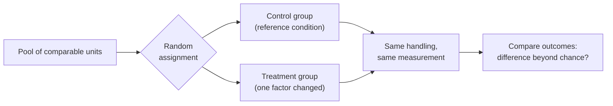

---
aliases:
  - Control Group
  - Independent Variable
  - Dependent Variable
  - Expérience contrôlée
  - Groupe témoin
tags:
  - type/concept
  - domain/scientific-practice
  - domain/statistics
  - domain/biology
  - level/L1
  - level/L2
  - level/L3
mastery: 0
prerequisites:
  - "[[Hypothesis]]"
  - "[[Deductive Reasoning]]"
related:
projects:
  - "[[07-evolution-simulator]]"
sources:
  - "[[Biology 2e (OpenStax)]]"
  - "[[Introductory Statistics (OpenStax)]]"
  - "[[Avery 1944 - Chemical Nature of the Substance Inducing Transformation of Pneumococcal Types]]"
  - "[[Experimental Design for Laboratory Biologists (Lazic)]]"
  - "[[Leek 2010 - Tackling the Widespread and Critical Impact of Batch Effects]]"
---

# Controlled Experiment

> [!abstract]
> A controlled experiment changes one factor on purpose, keeps everything else the same, and compares the result with a control group: if the groups differ only in that factor, a difference in outcome can be blamed on it.

## Definition

A **controlled experiment** compares groups of experimental units that are treated identically except for one deliberately changed factor, the **independent variable** (explanatory variable, treatment). A **control group** receives no treatment or a reference treatment, and the outcome, the **dependent variable** (response variable), is measured in every group.[^os1][^stat1] When the groups were comparable at the start and differ only in the treatment, an outcome difference larger than chance supports a causal claim about the treatment.[^stat1]

## Why it matters

- **Causal claims in biology** (this gene is needed for growth, this drug lowers expression) rest on controlled comparisons: knockout against wild type, treated against vehicle ([[Causality]]).
- **Batch effects** are a failure of control. When processing batch coincides with the biological groups, technical variation is confounded with the effect of interest; randomization and balanced processing prevent this at the design stage.[^leek]

## Core (L1)

### Vocabulary

| Term | Meaning | Example: does a promoter variant raise reporter expression? (invented) |
|---|---|---|
| Experimental unit | What is independently assigned to a treatment ([[Experimental Unit]]) | one transfected culture |
| Independent variable | The factor the experimenter changes | promoter variant or reference promoter |
| Dependent variable | The measured outcome | reporter fluorescence |
| Controlled variables | Factors held constant | cell line, medium, plasmid amount, time, instrument |
| Control group | Units given the reference condition | cultures with the reference promoter |



If the two groups are alike in every respect but one, a systematic difference in outcome is attributed to that respect. Every additional difference between groups (day, operator, cage, reagent lot) is a rival explanation: a **confounder** ([[Confounding]]).

### A classic: Avery, MacLeod and McCarty (1944)

The same purified transforming fraction was tested untreated and after treatment with different enzymes; recipient cells and culture conditions stayed the same.[^avery]

| Portion of the fraction | Changed factor | Transforming activity | What it rules out |
|---|---|---|---|
| untreated | none (reference) | present | shows the assay works |
| + trypsin, chymotrypsin | protein destroyed | present | protein as the active substance |
| + ribonuclease | RNA destroyed | present | RNA |
| + DNA-depolymerizing preparations | DNA destroyed | lost | (DNA is required) |

The weak point is a lesson in itself: the DNA-destroying preparations were crude, so more than one factor may have changed in that arm ([[Empirical Evidence#Deeper (L2)]]).

**Kinds of control.** A negative control (no treatment, or the vehicle alone, the solvent of a drug) shows what happens without the active factor; a positive control (a treatment known to work) shows that the assay can detect an effect. In human studies a placebo controls for the effect of being treated, and blinding keeps knowledge of the group from influencing subjects or evaluators.[^stat1] See [[Experimental Control]] and [[Blinding]].

## Deeper (L2)

**Randomize what you cannot hold constant.** Some factors can be held constant (same medium); others cannot, and many are unknown. Assigning units to groups at random balances them on average, which is why random assignment is a defining feature of a well-designed experiment.[^stat1][^lazic] Assignment by convenience (first plates to the treatment) or by judgment (healthiest animals to the new drug) builds a confounder into the design ([[Randomization]]). Known nuisance factors such as day or flow cell are better balanced by blocking ([[Randomized Block Design]]).

**Replicate the unit, not the measurement.** The sample size is the number of independently treated units. Measuring one culture three times gives technical replicates; it does not add evidence about the treatment ([[Biological Replicate]], [[Technical Replicate]], [[Pseudoreplication]]).[^lazic]

## Advanced (L3)

- **Confounded omics designs.** If all treated samples are sequenced in one batch and all controls in another, the batch effect and the treatment effect are inseparable, and no statistical correction can recover the treatment effect from those data alone.[^leek] The simulation below shows the bias.
- **When experiments are impossible.** Many questions (human exposures, evolution in the wild) cannot be assigned at random; [[Observational Study|observational studies]] then need explicit causal assumptions, and their conclusions are weaker ([[Causality]], [[Randomized Controlled Trial]]).

## Mathematical representation

Units $i = 1, \dots, n$ are split by random assignment into a treated set $T$ ($|T| = n_T$) and a control set $C$. Each unit has two potential outcomes, $y_i(1)$ if treated and $y_i(0)$ if not; only one is observed. The estimate is

$$\hat\delta = \bar y_T - \bar y_C = \frac{1}{n_T} \sum_{i \in T} y_i(1) - \frac{1}{n - n_T} \sum_{i \in C} y_i(0).$$

**Unbiasedness from randomization.** Each unit is in $T$ with probability $n_T / n$, so $E[\bar y_T] = \frac{1}{n} \sum_i y_i(1)$ and $E[\bar y_C] = \frac{1}{n} \sum_i y_i(0)$: $E[\hat\delta]$ is the average effect over all units, whatever the unmeasured factors.

**Confounding.** If units processed on day 2 gain $b$ whatever their group, and all treated units are processed on day 2, then $E[\hat\delta] = \text{effect} + b$: the two cannot be separated.

**Randomization test.** Under the sharp null hypothesis "the treatment changes no unit's outcome", the observed outcomes are fixed and only the labels were random. Each of the $\binom{n}{n_T}$ assignments was equally likely, so the two-sided p-value is the fraction of assignments with $|\hat\delta^*| \ge |\hat\delta_{\text{obs}}|$ ([[Permutation Test]], [[Hypothesis Testing]]).

## Computational representation

An exact randomization test on invented data, then a simulation of a confounded design:

```python
import random
import statistics
from itertools import combinations

def diff_means(treated: list[float], control: list[float]) -> float:
    return statistics.mean(treated) - statistics.mean(control)

def randomization_test(treated: list[float], control: list[float]) -> tuple[float, float]:
    """Exact two-sided p-value: share of all relabelings at least as extreme as the observed one."""
    pooled, n_t = treated + control, len(treated)
    observed = diff_means(treated, control)
    extreme = total = 0
    for idx in combinations(range(len(pooled)), n_t):
        t = [pooled[i] for i in idx]
        c = [pooled[i] for i in range(len(pooled)) if i not in idx]
        total += 1
        extreme += abs(diff_means(t, c)) >= abs(observed) - 1e-12
    return observed, extreme / total

# Invented data: reporter fluorescence (arbitrary units) of 6 control and 6 treated cultures
control = [10.2, 9.8, 11.1, 10.5, 9.6, 10.9]
treated = [12.0, 11.4, 12.9, 11.8, 10.7, 12.4]
d, p = randomization_test(treated, control)
print(f"difference = {d:.3f}, p = {p:.4f} ({round(p * 924)} of 924 labelings)")

# Confounding: true effect 0, every unit processed on day 2 gains +1.5 (invented)
rng = random.Random(7)

def one_experiment(design: str) -> float:
    day = [1] * 6 + [2] * 6                                  # units 0-5 on day 1, 6-11 on day 2
    treated_units = set(range(6, 12)) if design == "treated on day 2" else set(rng.sample(range(12), 6))
    y = [rng.gauss(10, 0.5) + (1.5 if day[u] == 2 else 0.0) for u in range(12)]
    return diff_means([y[u] for u in range(12) if u in treated_units],
                      [y[u] for u in range(12) if u not in treated_units])

for design in ("treated on day 2", "random assignment"):
    est = [one_experiment(design) for _ in range(10_000)]
    print(f"{design:17s}: mean estimate {statistics.mean(est):+.3f}, sd {statistics.stdev(est):.3f}")
```

Output:

```text
difference = 1.517, p = 0.0065 (6 of 924 labelings)
treated on day 2 : mean estimate +1.498, sd 0.287
random assignment: mean estimate +0.002, sd 0.537
```

The confounded design "finds" an effect of 1.5 that is entirely the day; random assignment centers the estimate on the true effect, 0, at the price of more spread (the day effect now adds noise instead of bias). Blocking by day would remove both.

## Worked example

> [!example] Reading the randomization test (invented data above)
> 1. **Effect**: treated cultures are 1.52 fluorescence units brighter on average.
> 2. **Null distribution and extremeness**: of the $\binom{12}{6} = 924$ ways to call 6 of the 12 cultures "treated", only 6, the observed one and its mirror image among them, give a difference at least as large in absolute value.
> 3. **p-value**: $6/924 = 0.0065$. If the variant had no effect on any culture, a split this extreme would arise by the random assignment alone in fewer than 1 % of assignments.
> 4. **Causal reading**: justified only because assignment was random and every culture was handled alike; with all variant cultures transfected on a different day, the same numbers would prove nothing.

## Common misconceptions

> [!warning] "The control group is simply the untreated group"
> A control can be a vehicle, a placebo, a reference treatment or a known positive. The right control is the one that differs from the treatment in the factor of interest only.

> [!warning] "We can adjust for the batch afterwards"
> Only if batch and treatment are not confounded. When they coincide, the data cannot tell them apart.[^leek]

## Exercises

> [!question] Exercise 1 (L1)
> A lab tests whether a drug reduces bacterial growth: 5 cultures receive the drug dissolved in DMSO, 5 receive nothing, and optical density is read after 8 hours. Name the independent and dependent variables, two controlled variables, and the flaw in the control group.

> [!success]- Solution
> Independent: drug or not. Dependent: optical density at 8 h. Controlled: strain, medium, temperature, inoculum size, reading time. Flaw: the controls lack DMSO, so the groups differ in two factors (drug and solvent); the control should receive DMSO alone (vehicle control).

> [!question] Exercise 2 (L1)
> Treated mice are kept in cage A and controls in cage B; one technician weighs the treated mice each morning and the controls each afternoon. List the confounders and say what the experimental unit really is.

> [!success]- Solution
> Cage (shared microbiota, temperature, social effects) and time of weighing (feeding state) both coincide with treatment. Since treatment was applied by cage, the cage is the experimental unit: this design has n = 1 per group ([[Experimental Unit]], [[Pseudoreplication]]). Fix: several cages per group assigned at random, mice weighed in random order at the same time of day.

> [!question] Exercise 3 (L2, Python)
> With `randomization_test`, analyze treated = [5.9, 5.4, 6.3, 5.2] and control = [5.1, 4.8, 5.6, 5.0] (invented). How many labelings are there, and what do you conclude?

> [!success]- Solution
> ```python
> d, p = randomization_test([5.9, 5.4, 6.3, 5.2], [5.1, 4.8, 5.6, 5.0])
> print(f"{d:.3f} {p:.4f}")   # 0.575 0.1429
> ```
> $\binom{8}{4} = 70$ labelings, 10 of them at least as extreme: $p = 0.14$. The difference is compatible with chance at this sample size; this is not evidence of no effect, and with 4 units per group even the most extreme split gives $p = 2/70 = 0.029$.

> [!question] Exercise 4 (L3)
> Design an in silico controlled experiment in [[07-evolution-simulator]] for the question "Does a higher mutation rate speed up adaptation?" State the factor, the response, what is held constant, the replication and the role of random seeds.

> [!success]- Solution
> Factor: mutation rate, at two or more values. Response: generations until mean fitness reaches a threshold, fixed before running. Held constant: population size, selection model, initial population, number of generations, code version. Replication: e.g. 50 independent runs per rate, each with its own seed; using the same 50 seeds for every rate pairs the runs ([[Paired Design]]). Analysis: difference of mean response with a randomization or paired test. Changing the code version between conditions would act like a batch effect.

## Mastery checklist

- [ ] 1 Recognized: I can name the independent and dependent variables, controlled variables and control group of an experiment.
- [ ] 2 Understood: I can explain why one changed factor plus random assignment supports a causal claim, and what confounding destroys.
- [ ] 3 Practiced: I can compute a difference of means and an exact randomization test in Python.
- [ ] 4 Applied: I design Lab simulations and benchmarks with one factor changed, fixed seeds and replicates, and check real data sets for batch-treatment confounding.
- [ ] 5 Explained: I can teach negative and positive controls, experimental units, randomization versus blocking, and the limits of post-hoc adjustment.

## References

[^os1]: [[Biology 2e (OpenStax)]], ch. 1 "The Study of Life", section 1.1 "The Science of Biology" (experimental and control groups, independent and dependent variables).
[^stat1]: [[Introductory Statistics (OpenStax)]], 2nd ed., ch. 1 "Sampling and Data", experimental design (explanatory and response variables, treatments, random assignment, lurking variables, control group, placebo, blinding).
[^avery]: [[Avery 1944 - Chemical Nature of the Substance Inducing Transformation of Pneumococcal Types]], Avery OT, MacLeod CM, McCarty M, *Journal of Experimental Medicine* 79(2):137-158.
[^lazic]: [[Experimental Design for Laboratory Biologists (Lazic)]], material on experimental units, replication, randomization and blinding.
[^leek]: [[Leek 2010 - Tackling the Widespread and Critical Impact of Batch Effects]], Leek JT et al., *Nature Reviews Genetics* 11(10):733-739.
