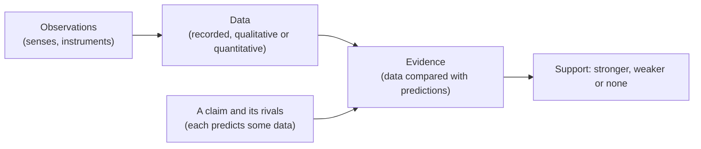

---
aliases:
  - Evidence
  - Empirical Claim
  - Preuve empirique
tags:
  - type/concept
  - domain/scientific-practice
  - domain/bioinformatics
  - level/L1
  - level/L2
mastery: 0
prerequisites: []
related:
  - "[[Inductive Reasoning]]"
  - "[[Hypothesis]]"
  - "[[Falsifiability]]"
  - "[[Hierarchy of Evidence]]"
projects: []
sources:
  - "[[Biology 2e (OpenStax)]]"
  - "[[The Logic of Scientific Discovery (Popper)]]"
  - "[[Mendel 1866 - Experiments in Plant Hybridization]]"
  - "[[Avery 1944 - Chemical Nature of the Substance Inducing Transformation of Pneumococcal Types]]"
  - "[[Gene Ontology]]"
  - "[[UniProt]]"
  - "[[Reproducibility and Replicability in Science (National Academies)]]"
  - "[[Introduction to Probability (Blitzstein)]]"
---

# Empirical Evidence

> [!abstract]
> Empirical evidence is what observation and measurement tell us about a claim: data become evidence only when they are compared with what that claim, and its rivals, predict.

## Definition

An **empirical claim** is a statement about the world whose truth depends on how the world is, so that some possible observation could count against it.[^popper] **Empirical evidence** is information obtained by observation or experiment that makes such a claim more or less credible than its alternatives.[^os1] Four words are worth keeping apart:

| Term | What it is | Example (Mendel's peas)[^mendel] |
|---|---|---|
| Observation | One act of noticing or recording, by the senses or an instrument | "This F2 seed is wrinkled." |
| Data | Recorded observations or measurements, qualitative or quantitative[^os1] | 5,474 round and 1,850 wrinkled F2 seeds |
| Evidence | Data read against a claim and its alternatives | 2.96:1 fits "3:1 segregation" far better than "1:1" |
| Opinion | A judgment or preference that data cannot settle, or a claim offered without data | "This is the most elegant experiment in genetics." |

## Why it matters

- **Databases mix observations and inferences.** Gene Ontology annotations carry an evidence code: the experimental codes (EXP, IDA, IPI, IMP, IGI, IEP) record a measurement, while automatically generated annotations are not experimental evidence.[^go] UniProtKB separates curator-reviewed Swiss-Prot entries from automatically annotated TrEMBL entries for the same reason.[^uniprot] Filtering by evidence is a routine step of [[Gene Annotation|annotation]] and enrichment work.
- **Raw data versus claims.** A FASTQ file is data; "gene X is upregulated" is a claim that depends on alignment, normalization and a statistical model. Keeping the raw data and code lets others obtain the same result again ([[Reproducibility]]).[^nasem]

## Core (L1)

### From observation to evidence



Biology records **qualitative** data (round or wrinkled, rough or smooth colonies) and **quantitative** data (counts, lengths, concentrations), often with images.[^os1] Both are empirical.

### What makes a claim empirical

A claim is empirical when a conceivable observation could contradict it.[^popper]

| Claim | Kind | Could an observation contradict it? |
|---|---|---|
| "In an F2 from round × wrinkled true-breeding peas, about 3/4 of seeds are round." | empirical | yes: a 1:1 count would |
| "A homozygote carries two identical alleles." | definition | no: it fixes the meaning of a word |
| "Labs should share raw data." | normative (a value) | no: data inform it but cannot settle it |
| "This gene probably matters in some way." | vague | no outcome counts against it ([[Falsifiability]]) |

## Deeper (L2)

**Evidence by elimination.** In Avery, MacLeod and McCarty's work (1944), a highly purified fraction from type III pneumococci, in minute amounts, transformed unencapsulated R cells derived from type II into encapsulated type III cells. Its activity survived crystalline trypsin, chymotrypsin and ribonuclease, but was lost with crude enzyme preparations able to depolymerize DNA.[^avery] Each result is a datum; together they are evidence that DNA, not protein or RNA, carries the activity, because each candidate predicted a different pattern of results. The design behind this is the subject of [[Controlled Experiment]].

**What makes evidence strong.** Enough data to separate the rivals (7,324 seeds separate 3:1 from 2:1, 12 seeds cannot: Exercise 2); independent observations (ten measurements of one sample are not ten pieces of evidence about a population: [[Technical Replicate]], [[Pseudoreplication]]); replication by independent studies with their own data;[^nasem] and freedom from bias ([[Confirmation Bias]], [[Measurement Error]]). [[Hierarchy of Evidence]] ranks study designs by strength. Absence of evidence is weak evidence of absence: a small experiment may simply miss a real effect ([[Statistical Power]]).

## Mathematical representation

How strongly data $D$ favor a claim $H_1$ over a rival $H_2$ can be measured by the **likelihood ratio**

$$\Lambda = \frac{P(D \mid H_1)}{P(D \mid H_2)},$$

where $P(D \mid H)$ is the probability of the observed data if $H$ is true. In the odds form of [[Bayes' Theorem]], posterior odds equal $\Lambda$ times prior odds, so $\Lambda > 1$ moves belief toward $H_1$ whatever the prior.[^blitz2] For $k$ seeds of the dominant form among $n$, under a model in which each seed is dominant with probability $p$, $P(D \mid p) = \binom{n}{k} p^k (1 - p)^{n - k}$, and the binomial coefficient cancels in $\Lambda$. Evidence is a relation between data and *two* claims, never a property of the data alone.

## Computational representation

```python
from math import lgamma, log

def log10_likelihood(k: int, n: int, p: float) -> float:
    """log10 P(k dominant-phenotype seeds among n | each is dominant with probability p)."""
    log_coef = lgamma(n + 1) - lgamma(k + 1) - lgamma(n - k + 1)
    return (log_coef + k * log(p) + (n - k) * log(1 - p)) / log(10)

def log10_lr(k: int, n: int, p1: float, p2: float) -> float:
    """log10 likelihood ratio of the model p1 against the model p2, for the same data."""
    return log10_likelihood(k, n, p1) - log10_likelihood(k, n, p2)

# Mendel (1866), F2 counts, dominant form first
for trait, k, other in (("seed shape", 5474, 1850), ("seed colour", 6022, 2001)):
    n = k + other
    print(f"{trait}: {k / other:.2f}:1, log10 LR 3:1 vs 2:1 = {log10_lr(k, n, 3/4, 2/3):.1f}, "
          f"3:1 vs 1:1 = {log10_lr(k, n, 3/4, 1/2):.1f}")
```

Output:

```text
seed shape: 2.96:1, log10 LR 3:1 vs 2:1 = 48.9, 3:1 vs 1:1 = 407.0
seed colour: 3.01:1, log10 LR 3:1 vs 2:1 = 58.0, 3:1 vs 1:1 = 458.1
```

The seed-shape counts are about $10^{49}$ times more probable under 3:1 than under 2:1. That is decisive *between these models*; it does not exclude a fourth model nobody wrote down.

## Worked example

> [!example] Sorting statements about an RNA-seq experiment (invented)
> Three treated and three control cultures are sequenced.
> 1. "Library T1 has 21.4 million reads" is **data**; "in the genome browser, reads pile up on gene *abcX* in T1" is an **observation**.
> 2. "Mean normalized count of *abcX* is 4.1 times higher in treated cultures." **Data**, derived by a stated pipeline.
> 3. "The treatment induces *abcX*." **Claim**: the fold change is evidence for it only against rivals such as a batch difference or one outlier culture.
> 4. "*abcX* is the most exciting gene of the screen." **Opinion**.

## Common misconceptions

> [!warning] "The data speak for themselves"
> Data become evidence only when compared with what claims predict. The same counts can support one hypothesis against a second and say nothing about a third.

> [!warning] "Empirical means numerical"
> Qualitative observations (a wrinkled seed, a smooth colony) are empirical data too.[^os1] What makes a claim empirical is that an observation could contradict it.

## Exercises

> [!question] Exercise 1 (L1)
> Which claims are empirical? (a) "A codon is a group of three nucleotides." (b) "mRNA is read in non-overlapping triplets." (c) "Gene names should follow one nomenclature." (d) "$\binom{4}{2} = 6$." (e) "*E. coli* grows faster in rich medium than in minimal medium."

> [!success]- Solution
> (b) and (e) are empirical: an experiment could have shown otherwise, and for (b) the frameshift experiments tested it ([[Genetic Code]]). (a) is a definition, adopted after (b) was established. (c) is normative. (d) is mathematics.

> [!question] Exercise 2 (L2, Python)
> Suppose Mendel had stopped after 12 seeds, 9 round and 3 wrinkled (invented). With `log10_lr`, compute the likelihood ratio of 3:1 against 2:1 and compare with the full data.

> [!success]- Solution
> ```python
> print(round(log10_lr(9, 12, 3/4, 2/3), 3), round(10 ** log10_lr(9, 12, 3/4, 2/3), 2))
> # 0.086 1.22
> ```
> The data favor 3:1 by a factor of 1.22 only: practically no evidence either way, against $10^{49}$ with 7,324 seeds. Small samples rarely discriminate between close models.

> [!question] Exercise 3 (L2)
> You predict 200 "kinase-like" genes in a new genome by sequence similarity, then report that the GO term "protein kinase activity" is strongly enriched among them, using all GO annotations. Why is this not independent evidence, and how would you fix it?

> [!success]- Solution
> Automatic annotations are themselves inferences, largely from sequence similarity,[^go] so the same similarity selected the genes and labelled them: the enrichment is circular. Restrict to experimental evidence codes, or test the prediction with data not derived from sequence, such as a biochemical assay of a sample of the genes.

## Mastery checklist

- [ ] 1 Recognized: I can define observation, data, evidence and opinion and give an example of each.
- [ ] 2 Understood: I can say what makes a claim empirical and why evidence is always relative to alternatives.
- [ ] 3 Practiced: I can compute a likelihood ratio between two models for count data in Python.
- [ ] 4 Applied: I check GO evidence codes and UniProt review status before using annotations as evidence in an analysis.
- [ ] 5 Explained: I can teach why strong evidence needs amount, independence, replication and freedom from bias, with the Avery and Mendel examples.

## References

[^os1]: [[Biology 2e (OpenStax)]], ch. 1 "The Study of Life", section 1.1 "The Science of Biology" (observation, qualitative and quantitative data, the process of science).
[^popper]: [[The Logic of Scientific Discovery (Popper)]], part on demarcation and the empirical basis (empirical statements as those that observations could contradict; basic statements accepted provisionally).
[^mendel]: [[Mendel 1866 - Experiments in Plant Hybridization]], monohybrid F2 counts for seed shape and seed colour.
[^avery]: [[Avery 1944 - Chemical Nature of the Substance Inducing Transformation of Pneumococcal Types]], Avery OT, MacLeod CM, McCarty M, *Journal of Experimental Medicine* 79(2):137-158.
[^go]: [[Gene Ontology]], annotations and evidence codes (experimental codes; automatic annotations are not experimental evidence).
[^uniprot]: [[UniProt]], UniProtKB sections Swiss-Prot (reviewed) and TrEMBL (unreviewed).
[^nasem]: [[Reproducibility and Replicability in Science (National Academies)]], definitions of reproducibility and replicability.
[^blitz2]: [[Introduction to Probability (Blitzstein)]], 2nd ed., ch. 2 "Conditional Probability" (odds form of Bayes' rule).
