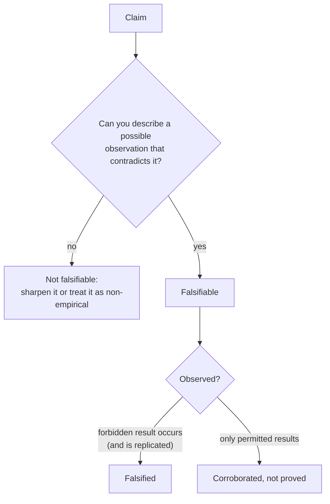

---
aliases:
  - Refutability
  - Popper's Criterion
  - Demarcation Criterion
  - Réfutabilité
tags:
  - type/concept
  - domain/scientific-practice
  - level/L1
  - level/L2
mastery: 0
prerequisites:
  - "[[Deductive Reasoning]]"
  - "[[Hypothesis]]"
related:
  - "[[Inductive Reasoning]]"
  - "[[Scientific Theory]]"
projects: []
sources:
  - "[[The Logic of Scientific Discovery (Popper)]]"
  - "[[Biology 2e (OpenStax)]]"
  - "[[On the Origin of Species (Darwin)]]"
  - "[[Meselson 1958 - The Replication of DNA in Escherichia coli]]"
  - "[[Ioannidis 2005 - Why Most Published Research Findings Are False]]"
  - "[[Introductory Statistics (OpenStax)]]"
---

# Falsifiability

> [!abstract]
> A claim is falsifiable when some possible observation would show it wrong; Popper made this the mark of an empirical claim, and the practical test is to ask "what result would make me give it up?"

## Definition

A statement or theory is **falsifiable** (testable, refutable) when it is logically incompatible with at least one possible observation: it divides the possible observation statements into those it **forbids**, its potential falsifiers, and those it permits. Popper proposed falsifiability as the **criterion of demarcation** between empirical science and other kinds of statements (mathematics, metaphysics), not as a criterion of meaning.[^popper] Biology textbooks state the same requirement for hypotheses: they must be testable and falsifiable, so that experimental results could disprove them.[^os1] Falsifiable does not mean false; a claim is **falsified** when a result it forbids is actually observed and accepted.

## Why it matters

- **Plans and benchmarks need a failure condition.** If no result of a pipeline could count against a claim, running it can only confirm; "tool A is better" forbids nothing until the metric, data set and margin are fixed.
- **Analytic flexibility erodes falsifiability.** When normalization, filters, covariates and thresholds can be chosen after seeing the results, almost any claim can be made to "work". Ioannidis lists flexibility in designs, definitions, outcomes and analyses among the conditions that make published findings less likely to be true.[^ioannidis]

## Core (L1)



No finite number of observations verifies "every X is Y", but one accepted counterexample contradicts it. Popper built his account of science on this asymmetry: theories are corroborated by surviving serious attempts to refute them, never verified ([[Inductive Reasoning]]).[^popper]

| Claim | Forbids | Falsifiable? |
|---|---|---|
| "DNA replicates semiconservatively." | heavy and light bands after one generation of a ¹⁵N to ¹⁴N shift, among others | yes (and it survived the test)[^meselson] |
| "DNA replicates conservatively." | a single hybrid band after one generation | yes, and falsified[^meselson] |
| "Gene X influences disease Y in some way, in some conditions." | nothing | no |
| "If it could be demonstrated that any complex organ existed, which could not possibly have been formed by numerous, successive, slight modifications, my theory would absolutely break down." (Darwin)[^darwin] | such an organ | yes: Darwin named a falsifier for gradual [[Natural Selection]] |

## Deeper (L2)

**Ad hoc rescue.** After a failed prediction, one can always save a theory by adding an assumption made up for the purpose, or by reinterpreting the data. Popper called such moves conventionalist stratagems and proposed a methodological rule against them: an auxiliary hypothesis is acceptable only if it does not reduce the theory's falsifiability, that is, if it can itself be tested.[^popper] "The drug failed because those tumours were resistant" is ad hoc if resistance is defined by the failure; it is a new testable hypothesis if resistance is measured beforehand by a stated marker.

**Limits.** A failed prediction contradicts the hypothesis together with its auxiliary assumptions, so logic alone does not say which to give up ([[Deductive Reasoning#Auxiliary assumptions]]); and scientists do not drop a productive theory at the first anomaly ([[Paradigm Shift]]). Falsifiability says that a claim is testable, not that it is good.

## Mathematical representation

Let $\Omega$ be the set of possible outcomes of an experiment. A claim $H$ **permits** a subset $\Pi(H) \subseteq \Omega$ and **forbids** its complement $F(H) = \Omega \setminus \Pi(H)$.

- $H$ is falsifiable iff $F(H) \neq \varnothing$.
- An observed outcome $o$ falsifies $H$ iff $o \in F(H)$.
- $H_1$ is more falsifiable than $H_2$ when $F(H_2) \subset F(H_1)$: it forbids everything $H_2$ forbids, and more, so it says more about the world. Popper compared theories by such inclusion of their classes of potential falsifiers, and preferred bold, highly testable hypotheses.[^popper]
- For a probabilistic $H$ ("each child inherits the allele with probability 1/2"), every $o$ has $P(o \mid H) > 0$, so strictly $F(H) = \varnothing$. Popper proposed a methodological decision to treat sufficiently improbable results as falsifying;[^popper] a statistical test implements it with a rejection region $R$ fixed in advance, $P(R \mid H) \le \alpha$ ([[Hypothesis Testing]]).[^os9]

## Computational representation

The outcome space of a two-generation density-shift experiment: at each generation the gradient shows a non-empty set of bands among heavy, hybrid, "quarter" (between hybrid and light) and light. Each claim is a predicate on outcomes:

```python
from itertools import combinations

BANDS = ("heavy", "hybrid", "quarter", "light")
patterns = [frozenset(c) for r in range(1, 5) for c in combinations(BANDS, r)]
omega = [(g1, g2) for g1 in patterns for g2 in patterns]      # all (gen 1, gen 2) band patterns

def only(*outcomes):
    allowed = {(frozenset(a), frozenset(b)) for a, b in outcomes}
    return lambda o: o in allowed

SEMI, CONS, DISP = ({"hybrid"}, {"hybrid", "light"}), ({"heavy", "light"}, {"heavy", "light"}), ({"hybrid"}, {"quarter"})
claims = {
    "semiconservative": only(SEMI),
    "conservative": only(CONS),
    "dispersive": only(DISP),
    "one of the three models": only(SEMI, CONS, DISP),
    "DNA is copied somehow": lambda o: True,
}
observed = (frozenset({"hybrid"}), frozenset({"hybrid", "light"}))
print("possible outcomes:", len(omega))
for name, permits in claims.items():
    forbidden = sum(not permits(o) for o in omega)
    print(f"{name:24s} forbids {forbidden:3d}  {'survives' if permits(observed) else 'falsified'}")
```

Output:

```text
possible outcomes: 225
semiconservative         forbids 224  survives
conservative             forbids 224  falsified
dispersive               forbids 224  falsified
one of the three models  forbids 222  survives
DNA is copied somehow    forbids   0  survives
```

Every claim that survives is consistent with the data, but they are not equally informative: "DNA is copied somehow" survives because it risked nothing. The predictions themselves are derived in [[Deductive Reasoning]].

## Worked example

> [!example] Sharpening an enrichment claim (invented study)
> **Original**: "Our expression data suggest that immune pathways are involved in the disease."
> 1. **What does it forbid?** Nothing: no pathway list, no direction, no threshold, no data set is named.
> 2. **Sharpen**: "Genes of the interferon-response set (a named, versioned gene set) have higher mean expression in patients than in controls."
> 3. **Fix the test and its falsifier in advance**: statistic (gene-set score), significance level and an independent validation cohort; the claim fails if the score is not higher in patients there, at the pre-set level.
> 4. **Result**: the claim now forbids an observable outcome; if it survives, it means something.

## Common misconceptions

> [!warning] "Falsifiable means false, or already disproved"
> It means a possible result *would* refute it. The semiconservative model is falsifiable and has survived every test.

> [!warning] "Evolution is unfalsifiable"
> Darwin himself stated an observation that would break his theory of gradual natural selection.[^darwin]

## Exercises

> [!question] Exercise 1 (L1)
> Falsifiable or not? Rewrite the unfalsifiable ones. (a) "This mutation may affect protein function." (b) "This missense mutation lowers enzyme activity by at least half in vitro." (c) "Every gene has a function, discovered or not." (d) "Knocking out gene X in yeast is lethal on rich medium."

> [!success]- Solution
> (b) and (d) are falsifiable: a full-activity mutant or a growing knockout would refute them. (a) forbids nothing ("may"): rewrite as (b). (c) excuses every failure in advance ("not yet discovered"): rewrite as "deleting gene X causes a measurable phenotype under conditions C".

> [!question] Exercise 2 (L2, Python)
> Using `claims` and `omega`, check whether the generation-1 outcomes alone can distinguish semiconservative from dispersive replication, and semiconservative from conservative.

> [!success]- Solution
> ```python
> gen1 = lambda claim: {o[0] for o in omega if claims[claim](o)}
> print(gen1("semiconservative") == gen1("dispersive"), gen1("semiconservative") == gen1("conservative"))
> # True False
> ```
> At generation 1, semiconservative and dispersive permit the same pattern (one hybrid band), so no generation-1 result can falsify one without the other. The second generation is what makes the experiment decisive.

> [!question] Exercise 3 (L2, Python)
> An analyst can choose among 3 normalizations, 4 filters and 2 tests, and reports whichever of the 24 analyses is significant at 0.05. If the null is true and the analyses were independent, what is the probability that at least one is significant? What does this do to falsifiability?

> [!success]- Solution
> ```python
> print(round(1 - 0.95 ** 24, 3))   # 0.708
> ```
> About 71 % (less if the analyses are correlated, as they are in practice, but far above 5 %). A claim that will be declared supported under most outcomes forbids little: flexibility makes it nearly unfalsifiable.[^ioannidis] The cure is to fix the analysis before seeing the result, or to correct for every analysis tried.

## Mastery checklist

- [ ] 1 Recognized: I can state Popper's criterion and say what falsifiable, falsified and corroborated mean.
- [ ] 2 Understood: I can explain the asymmetry between verification and refutation and spot claims that cannot fail.
- [ ] 3 Practiced: I can represent claims as permitted outcome sets in code and compare how much they forbid.
- [ ] 4 Applied: before an analysis, I write the result that would count against my claim and fix the analysis choices.
- [ ] 5 Explained: I can teach degrees of falsifiability, ad hoc rescue, probabilistic claims and the limits of strict falsificationism.

## References

[^popper]: [[The Logic of Scientific Discovery (Popper)]], parts on demarcation (falsifiability as the criterion of empirical science, potential falsifiers, degrees of testability), on conventionalist stratagems and auxiliary hypotheses, and on probability statements.
[^os1]: [[Biology 2e (OpenStax)]], ch. 1 "The Study of Life", section 1.1 "The Science of Biology" (testable and falsifiable hypotheses).
[^darwin]: [[On the Origin of Species (Darwin)]], 1st ed. (1859), p. 189.
[^meselson]: [[Meselson 1958 - The Replication of DNA in Escherichia coli]], Meselson M, Stahl FW, *PNAS* 44(7):671-682.
[^ioannidis]: [[Ioannidis 2005 - Why Most Published Research Findings Are False]], *PLoS Medicine* 2(8):e124 (corollary on flexibility in designs, definitions, outcomes and analytical modes).
[^os9]: [[Introductory Statistics (OpenStax)]], 2nd ed., ch. 9 "Hypothesis Testing with One Sample" (significance level and the decision rule).
