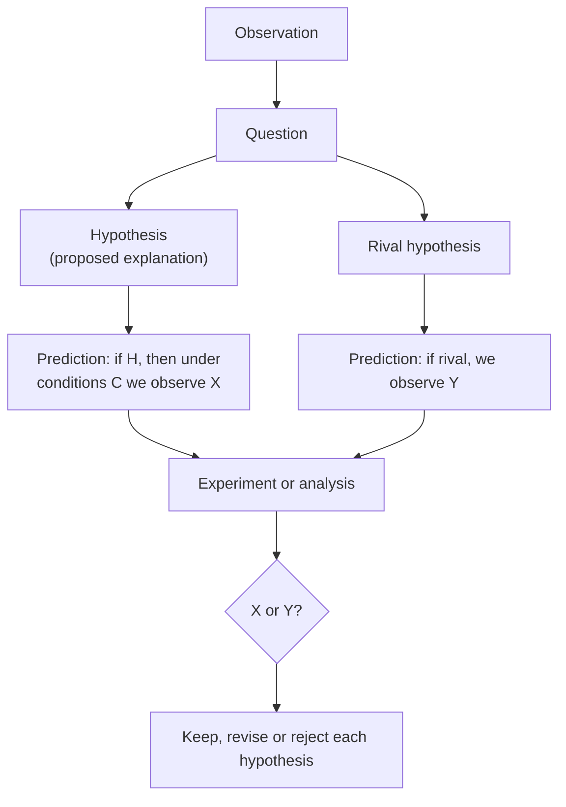

---
aliases:
  - Scientific Hypothesis
  - Prediction
  - Hypothèse
tags:
  - type/concept
  - domain/scientific-practice
  - domain/statistics
  - domain/biology
  - level/L1
  - level/L2
  - level/L3
mastery: 0
prerequisites:
  - "[[Empirical Evidence]]"
  - "[[Inductive Reasoning]]"
  - "[[Deductive Reasoning]]"
related:
  - "[[Falsifiability]]"
  - "[[Controlled Experiment]]"
  - "[[Hypothesis Testing]]"
  - "[[Hypothetico-Deductive Method]]"
projects:
  - "[[05-sequence-search]]"
sources:
  - "[[Biology 2e (OpenStax)]]"
  - "[[The Logic of Scientific Discovery (Popper)]]"
  - "[[Luria 1943 - Mutations of Bacteria from Virus Sensitivity to Virus Resistance]]"
  - "[[Introductory Statistics (OpenStax)]]"
  - "[[Platt 1964 - Strong Inference]]"
  - "[[Ioannidis 2005 - Why Most Published Research Findings Are False]]"
  - "[[Beadle 1941 - Genetic Control of Biochemical Reactions in Neurospora]]"
---

# Hypothesis

> [!abstract]
> A hypothesis is a proposed explanation stated so precisely that something observable follows from it: the prediction is what you check, and the statistical null hypothesis is only a tool for checking it.

## Definition

A **scientific hypothesis** is a proposed explanation for an observation that can be tested: consequences are deduced from it and compared with new observations. To be useful it must be testable and falsifiable, that is, some possible result must be able to show it wrong.[^os1][^popper] A **prediction** is one such consequence: what will be observed under stated conditions if the hypothesis is true. A **null hypothesis** $H_0$ is a different object: a precise statement about a parameter of a statistical model, typically "no effect" or "no difference", against an **alternative** $H_1$, chosen so that the distribution of a test statistic can be computed.[^os9]

## Why it matters

- **Bioinformatics produces many hypotheses cheaply.** A list of differentially expressed genes, an enriched pathway or a predicted function is a set of hypotheses to test, not a set of findings ([[Data-Driven Research]]).
- **Benchmarks are tests.** In [[05-sequence-search]], "the k-mer index is faster" becomes a hypothesis only once the speed measure, the data sizes and the expected size of the difference are fixed in advance.

## Core (L1)

### Question, hypothesis, prediction



A usable hypothesis states a mechanism, can be tested with available methods, yields a prediction that its rivals do not share, could fail ([[Falsifiability]]), and is written down before the test.

### A hypothesis that decided a question: Luria and Delbrück (1943)

**Observation.** When a bacterial culture is exposed to a bacteriophage, most cells are killed but a few resistant colonies grow, and their resistance is inherited.[^luria]

**Two hypotheses.**[^luria]
- **A, induced resistance**: contact with the phage makes a small random fraction of cells resistant.
- **B, spontaneous mutation**: resistant mutants arise at random during the growth of the culture, before any contact; the phage only selects them ([[Mutation]]).

**Predictions** for many small parallel cultures, each plated with phage. Under A, cells meet the phage only on the plate, so each culture's count is the sum of many rare independent events: counts vary like a [[Poisson Distribution]], with variance close to the mean. Under B, a mutation that happens early in one culture founds a large resistant clone, so a few cultures contain very many resistant cells and most contain few or none: variance far above the mean. Samples taken from one single culture should vary only like Poisson counts under both hypotheses, which makes them a control for counting noise.[^luria]

**Data.** In one series of 20 parallel cultures, 11 gave no resistant colony and the others gave 1, 1, 3, 5, 5, 6, 35, 64 and 107.[^luria] The mean is 11.35 and the variance 752, 66 times the mean ([[#Computational representation]]). The prediction of A fails; B predicted exactly this kind of fluctuation.

### Hypothesis, prediction, null hypothesis

| | Scientific hypothesis | Prediction | Null hypothesis $H_0$ |
|---|---|---|---|
| About | a mechanism or explanation | an observable outcome | a parameter of a statistical model |
| Fluctuation test | "resistance arises by mutation before exposure" | "across parallel cultures, variance ≫ mean" | "counts are Poisson: variance = mean" |
| Role | explains | is compared with data | is rejected or not by a test[^os9] |

Here $H_0$ formalizes the prediction of the rival hypothesis A, so rejecting it favors B because A and B were the only candidates on the table. In general, rejecting a "no difference" $H_0$ shows that something differs, not *why* ([[P-Value]]).

## Deeper (L2)

**Several hypotheses at once.** Platt argued that research advances fastest when several alternative hypotheses are set up together and an experiment is designed so that its possible outcomes exclude some of them.[^platt] The fluctuation test fits: A and B make opposite predictions about the *same* number, so one measurement discriminates. A test whose outcome both hypotheses predict ("resistant colonies appear") decides nothing ([[Strong Inference]]).

**Before the data, not after.** A hypothesis built to fit a data set has not been tested by that data set: the fit was guaranteed. Exploratory patterns are legitimate hypotheses, to be tested on new data.

## Advanced (L3)

- **From hypothesis to model.** Hypothesis B is quantitative: with a mutation rate and a growth law it predicts the whole distribution of counts. Under B, the number of mutation events per culture is approximately Poisson with some mean $m$, so the fraction of cultures with no mutant is $p_0 = e^{-m}$; with 11 of 20 cultures empty, $m \approx -\ln(11/20) = 0.60$ mutations per culture. A hypothesis that predicts numbers is more falsifiable, and more useful, than one that predicts a direction ([[Falsifiability#Mathematical representation]]).

## Mathematical representation

Let $X_1, \dots, X_n$ be the resistant counts of $n$ parallel cultures, with sample mean $\bar X$ and sample variance $s^2$.

- **Hypothesis A** (independent rare events on the plate): $X_i \sim \text{Poisson}(\lambda)$, so $E[X_i] = \operatorname{Var}(X_i) = \lambda$ ([[Poisson Distribution]]), and the **index of dispersion** $D = s^2 / \bar X$ should be close to 1.
- **Hypothesis B** (mutation during growth): a mutation at generation $t$ of a culture that grows for $g$ generations founds a clone of about $2^{g-t}$ cells. Early, rare mutations give huge clones, so $\operatorname{Var}(X_i) \gg E[X_i]$ and $D \gg 1$.

## Computational representation

Both hypotheses as simulators, with the same mean count; the parameters of B (50 starting cells, 20 doublings) are invented:

```python
import math
import random
import statistics

# Luria and Delbrück (1943): resistant colonies in 20 parallel cultures (sorted, not in the original order)
observed = [0] * 11 + [1, 1, 3, 5, 5, 6, 35, 64, 107]
mean = statistics.mean(observed)

def dispersion(counts: list[int]) -> float:
    return statistics.variance(counts) / max(statistics.mean(counts), 1e-9)

def poisson(lam: float, rng: random.Random) -> int:
    limit, k, prod = math.exp(-lam), 0, rng.random()
    while prod > limit:
        k += 1
        prod *= rng.random()
    return k

def culture_induced(rng: random.Random) -> int:
    """Hypothesis A: each plated cell becomes resistant on contact with phage, independently."""
    return poisson(mean, rng)

def culture_mutation(rng: random.Random, n0: int = 50, generations: int = 20) -> int:
    """Hypothesis B: mutations occur at random during growth; each mutant founds a resistant clone."""
    mu = mean / (generations * n0 * 2 ** generations)   # invented rate giving the observed mean on average
    sensitive, mutants = n0, 0
    for _ in range(generations):
        new = poisson(sensitive * mu, rng)
        sensitive, mutants = 2 * sensitive - new, 2 * mutants + new
    return mutants

obs = dispersion(observed)
print(f"observed: mean {mean:.2f}, variance {statistics.variance(observed):.0f}, variance/mean {obs:.1f}")
rng = random.Random(1943)
for name, culture, runs in (("A induced ", culture_induced, 2000), ("B mutation", culture_mutation, 500)):
    sims = [dispersion([culture(rng) for _ in range(20)]) for _ in range(runs)]
    print(f"{name}: median variance/mean {statistics.median(sims):5.1f}, "
          f"fraction of experiments >= observed {sum(s >= obs for s in sims) / runs:.3f}")
```

Output:

```text
observed: mean 11.35, variance 752, variance/mean 66.3
A induced : median variance/mean   1.0, fraction of experiments >= observed 0.000
B mutation: median variance/mean   8.0, fraction of experiments >= observed 0.084
```

None of 2,000 simulated experiments under A reaches the observed dispersion; under B, 8 % do, and the typical dispersion is far above 1. The data are incompatible with A and unremarkable under B.

## Worked example

> [!example] From a vague idea to a testable hypothesis ([[05-sequence-search]])
> 1. **Vague idea**: "indexing makes search faster."
> 2. **Hypothesis**: building a k-mer index once makes each query cheaper than a full scan, because a query only visits sequences that share a k-mer with it.
> 3. **Prediction**: on databases of $10^3$ to $10^6$ sequences, the time per query of the indexed search grows more slowly with database size than that of the naive scan, and beyond some size it is lower, while both return the same hits on a test set with known matches.
> 4. **Rival hypotheses**: index construction or memory access dominates, so no crossover appears in this range; or the index misses hits (speed bought with sensitivity).
> 5. **Null hypothesis for one comparison**: at $10^6$ sequences, the mean query times of the two methods are equal; tested over repeated queries ([[Hypothesis Testing]]).
> 6. **What would refute it**: no crossover up to $10^6$ sequences, or any hit returned by the scan but not by the index.

## Common misconceptions

> [!warning] "The null hypothesis is the opposite of my hypothesis"
> $H_0$ is a statement about a model parameter. Rejecting it shows that the data are unlikely under that model, not that your mechanism is correct; other explanations (confounding, batch effects, a different mechanism) can produce the same rejection.

> [!warning] "A supported hypothesis is proved, and becomes a theory"
> Support is always provisional ([[Inductive Reasoning]]). A [[Scientific Theory]] is a broad, well-tested explanatory framework, not a promoted hypothesis.

## Exercises

> [!question] Exercise 1 (L1)
> Beadle and Tatum isolated induced *Neurospora* mutants that could no longer make an essential nutrient.[^beadle] Write the observation, a hypothesis in their spirit, a prediction for a growth experiment, and a rival hypothesis.

> [!success]- Solution
> Observation: some mutants grow only if the medium is supplemented. Hypothesis: each mutation inactivates one enzyme, blocking one step of a biosynthetic pathway (their conclusion).[^beadle] Prediction: a mutant grows when given the product of the blocked step or any later intermediate, but not when given intermediates before the block. Rival: a mutation damages many reactions at once, so single supplements would not restore growth, and mutant phenotypes would not segregate as single genes.

> [!question] Exercise 2 (L2, Python)
> Under hypothesis A (Poisson with mean 11.35), how many of 20 cultures are expected to contain no resistant colony? Compare with the 11 observed, and compute the zero-class estimate $m = -\ln p_0$ under B.

> [!success]- Solution
> ```python
> print(f"{20 * math.exp(-mean):.5f}", round(-math.log(11 / 20), 2))   # 0.00024 0.6
> ```
> A expects 0.0002 empty cultures; 11 were observed. Even without variances, the zero class alone rejects A. Under B, 0.6 mutation events per culture explain why most cultures are empty and a few have jackpots.

> [!question] Exercise 3 (L3)
> In a field where 1 in 100 tested hypotheses is true, studies have power 0.8 and use $\alpha = 0.05$. Using the positive predictive value $\mathrm{PPV} = (1-\beta)R / ((1-\beta)R + \alpha)$ with pre-study odds $R$, compute the probability that a significant finding is true.[^ioannidis] What does it imply for choosing hypotheses?

> [!success]- Solution
> $R = 1/99 \approx 0.0101$, so $\mathrm{PPV} = 0.8 \times 0.0101 / (0.8 \times 0.0101 + 0.05) = 0.0081/0.0581 \approx 0.14$. Only about 1 significant finding in 7 is true. Testing plausible, well-motivated hypotheses (higher $R$) matters as much as statistical rigor.

## Mastery checklist

- [ ] 1 Recognized: I can define hypothesis, prediction and null hypothesis and tell them apart.
- [ ] 2 Understood: I can explain how the fluctuation test turned two hypotheses into two different predictions about one measurement.
- [ ] 3 Practiced: I can simulate rival hypotheses and compare their predictions with data in Python.
- [ ] 4 Applied: before a Lab benchmark or analysis, I write the hypothesis, its rivals, the prediction and the result that would refute it.
- [ ] 5 Explained: I can teach why rejecting $H_0$ does not prove a mechanism, and how prior plausibility affects the value of a significant result.

## References

[^os1]: [[Biology 2e (OpenStax)]], ch. 1 "The Study of Life", section 1.1 "The Science of Biology" (hypothesis, testable and falsifiable hypotheses, hypothesis testing).
[^popper]: [[The Logic of Scientific Discovery (Popper)]], parts on demarcation and on testing theories.
[^os9]: [[Introductory Statistics (OpenStax)]], 2nd ed., ch. 9 "Hypothesis Testing with One Sample" (null and alternative hypotheses).
[^luria]: [[Luria 1943 - Mutations of Bacteria from Virus Sensitivity to Virus Resistance]], Luria SE, Delbrück M, *Genetics* 28:491-511.
[^platt]: [[Platt 1964 - Strong Inference]], Platt JR, *Science* 146(3642):347-353.
[^ioannidis]: [[Ioannidis 2005 - Why Most Published Research Findings Are False]], *PLoS Medicine* 2(8):e124 (positive predictive value from pre-study odds, power and significance level).
[^beadle]: [[Beadle 1941 - Genetic Control of Biochemical Reactions in Neurospora]], Beadle GW, Tatum EL, *PNAS* 27(11):499-506.
