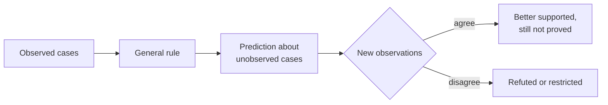

---
aliases:
  - Induction
  - Problem of Induction
  - Raisonnement inductif
tags:
  - type/concept
  - domain/scientific-practice
  - domain/statistics
  - level/L1
  - level/L2
  - level/L3
mastery: 0
prerequisites:
  - "[[Empirical Evidence]]"
related:
  - "[[Deductive Reasoning]]"
  - "[[Hypothesis]]"
  - "[[Falsifiability]]"
projects: []
sources:
  - "[[Biology 2e (OpenStax)]]"
  - "[[Stanford Encyclopedia of Philosophy]]"
  - "[[The Logic of Scientific Discovery (Popper)]]"
  - "[[Mendel 1866 - Experiments in Plant Hybridization]]"
  - "[[NCBI Genetic Codes]]"
  - "[[MIT 18.05 - Introduction to Probability and Statistics]]"
  - "[[Bayesian Data Analysis (Gelman)]]"
---

# Inductive Reasoning

> [!abstract]
> Inductive reasoning goes from observed cases to a general rule or a prediction about unobserved ones; it is how science generalizes, and its conclusions are always more or less probable, never proved.

## Definition

**Inductive reasoning** draws a general conclusion, or a prediction about cases not yet observed, from a set of particular observations.[^os1] Its conclusion says more than its premises, so true premises can make it probable but never guarantee it: this is the difference from [[Deductive Reasoning]].[^sep][^popper]

## Why it matters

- **Every sample-to-population step is inductive.** Three RNA-seq replicates stand for "the treatment"; a few sequenced strains stand for a species; a sample of cells stands for a tissue ([[Sampling]]).
- **Learning from data is induction automated.** A classifier trained on annotated genes is assumed to work on new genes. It fails when new data differ from the training data, which is why models are judged on data they have not seen ([[Cross-Validation]], [[Overfitting]]).

## Core (L1)

### From cases to a rule

Inductive reasoning uses related observations to reach a general conclusion; it is the typical reasoning of descriptive science.[^os1] Mendel's F2 counts are a classic case:[^mendel]

| Character | F2 counts | Ratio |
|---|---|---|
| Seed shape | 5,474 round : 1,850 wrinkled | 2.96:1 |
| Seed colour | 6,022 yellow : 2,001 green | 3.01:1 |
| Flower colour | 705 violet : 224 white | 3.15:1 |

From these cases he generalized: in the F2 of two true-breeding varieties that differ in one character, about 3/4 of offspring show the dominant form. The rule covers crosses nobody had made yet; that is what makes it useful, and what makes it uncertain ([[Mendelian Inheritance]] gives the conditions under which it holds).



### Why induction never proves

**Hume's problem.** No argument shows, without circularity, that unobserved cases resemble observed ones: justifying induction by its past successes is itself an induction. David Hume set out the problem in *A Treatise of Human Nature* (1739).[^sep] Popper drew the consequence that a universal law can never be verified by observations, however many, while a single accepted counterexample can contradict it.[^popper]

**A biological case.** Codon assignments worked out in a few experimental systems held in the organisms examined next, and "the code is universal" looked like a safe induction. It is only nearly true: vertebrate mitochondria read UGA as tryptophan and AUA as methionine, and NCBI now lists numbered variant tables.[^ncbi] The generalization was useful and well supported; it was never proved ([[Genetic Code]]).

## Deeper (L2)

**What makes an induction strong.** Many cases, so that chance patterns are unlikely; varied cases (organisms, conditions, labs), since a large biased sample stays biased: 10,000 cells from one tissue say little about other tissues ([[Sampling]]); no known counterexample despite a deliberate search; and a mechanism, such as segregating paired factors for the 3:1 ratio, which gives the rule a reason to hold beyond the counted crosses ([[Abductive Reasoning]]).

**Induction as Bayesian updating.** [[Bayes' Theorem]] makes induction precise: each observation updates the probability of a hypothesis, and the posterior after one observation is the prior for the next.[^1805] Confirming cases raise the probability of a universal claim without reaching 1, while one clear counterexample sends it to 0. To predict the next case after $n$ successes in $n$ trials with a uniform prior on the success probability, the answer is $(n+1)/(n+2)$, Laplace's **rule of succession**.[^gelman]

## Advanced (L3)

- **Popper's alternative.** Popper rejected induction as a method of justification: hypotheses are conjectures, and observations serve to test them ([[Falsifiability]], [[Hypothetico-Deductive Method]]).[^popper] In practice induction suggests hypotheses, deduction derives their consequences, and tests decide.
- **Exploratory omics.** A screen that tests 20,000 genes produces inductive candidates, many of them false ([[Multiple Testing Correction]]); the step from candidate to claim needs new, independent data ([[Data-Driven Research]]).

## Mathematical representation

Let $H$ be a universal claim ("every organism uses the standard code") with prior $\pi = P(H)$. Each observed case $E_i$ agrees with $H$; if $H$ is true it agrees with certainty, $P(E_i \mid H) = 1$; if $H$ is false it still agrees with probability $q < 1$. Assuming the cases independent given each hypothesis, the odds form of Bayes' theorem gives after $n$ cases

$$\frac{P(H \mid E_1, \dots, E_n)}{P(\neg H \mid E_1, \dots, E_n)} = \frac{\pi}{1 - \pi} \cdot \frac{1}{q^{n}}, \qquad P(H \mid E_{1..n}) = \frac{1}{1 + \frac{1 - \pi}{\pi} q^{n}} < 1.$$

The odds grow without bound but the probability stays below 1 for every finite $n$. A counterexample $E^*$ has $P(E^* \mid H) = 0$, so $P(H \mid E^*) = 0$: the asymmetry between confirmation and refutation.

**Rule of succession.** Let $\theta \in [0, 1]$ be an unknown success probability with uniform prior. After $n$ successes in $n$ trials the posterior density is proportional to $\theta^n$, that is $(n+1)\theta^n$, and the probability that the next trial succeeds is $\int_0^1 \theta \,(n+1)\theta^n \, d\theta = \frac{n+1}{n+2}$.

## Computational representation

```python
def update(prior: float, p_e_if_h: float, p_e_if_not_h: float) -> float:
    """Posterior P(H | E) from Bayes' theorem, for one piece of evidence E."""
    joint_h = prior * p_e_if_h
    return joint_h / (joint_h + (1 - prior) * p_e_if_not_h)

# H: "every organism uses the standard genetic code" (invented numbers)
p = 0.5                                    # prior P(H)
for n in range(1, 51):
    p = update(p, 1.0, 0.9)                # a confirming organism: certain under H, probability 0.9 under not-H
    if n in (1, 10, 20, 50):
        print(f"after {n:2d} confirming organisms: P(H) = {p:.4f}")
print("after one counterexample:", update(p, 0.0, 0.1))
```

Output:

```text
after  1 confirming organisms: P(H) = 0.5263
after 10 confirming organisms: P(H) = 0.7415
after 20 confirming organisms: P(H) = 0.8916
after 50 confirming organisms: P(H) = 0.9949
after one counterexample: 0.0
```

Fifty agreeing organisms took the claim from 0.5 to 0.995; one counterexample took it to 0. The value $q = 0.9$ matters: if a false claim would usually agree with observations anyway ($q$ close to 1), each confirmation is weak evidence.

## Worked example

> [!example] Is the 3:1 rule proved by Mendel's data?
> 1. **Premises**: specific counts from specific crosses, for example 5,474 : 1,850 for seed shape.[^mendel]
> 2. **Conclusion**: every monohybrid F2 shows about 3:1. It speaks about all future crosses, so it goes beyond the premises: induction.
> 3. **Limits**: all crosses were in one species, under one person's conditions; the rule could fail for characters that do not behave like Mendel's ([[Mendelian Inheritance]]).
> 4. **Verdict**: strongly supported, not proved. The way forward is to test predictions where the rule could fail, not to count more confirming cases.

## Common misconceptions

> [!warning] "Induction goes from specific to general, deduction from general to specific"
> A useful first heuristic, but the real difference is necessity. "All codons are triplets; triplets have three positions; so all codons have three positions" is general to general, and deductive.

> [!warning] "Enough confirming cases prove a rule"
> No finite number of cases proves a universal claim; the near-universal genetic code is the reminder.[^ncbi]

## Exercises

> [!question] Exercise 1 (L1)
> Inductive or deductive? (a) "All 50 sequenced genomes of a species carry gene X, so every genome of the species does." (b) "If replication is semiconservative, first-generation DNA is hybrid; it is semiconservative; so first-generation DNA is hybrid." (c) "The last 30 pipeline runs took under an hour, so the next will." (d) "A codon has three nucleotides, so a 6-nucleotide in-frame sequence holds two codons."

> [!success]- Solution
> (a) inductive (universal generalization), (b) deductive (modus ponens), (c) inductive (prediction), (d) deductive. In (a) and (c) the conclusion could be false with all premises true.

> [!question] Exercise 2 (L2, Python)
> Gene X is present in all 30 sequenced strains of a species. With a uniform prior, what is the rule-of-succession probability that the next strain carries it? How many all-positive strains are needed before that probability reaches 0.99?

> [!success]- Solution
> ```python
> print((30 + 1) / (30 + 2), next(n for n in range(1, 10**4) if (n + 1) / (n + 2) >= 0.99))
> # 0.96875 98
> ```
> 0.969 after 30 strains; 98 strains for 0.99. Caveat: sequenced strains are not a random sample of the species (they favor clinical or lab isolates), which the formula ignores.

> [!question] Exercise 3 (L3)
> A classifier predicting essential genes reaches 95 % accuracy on held-out genes of the bacterium it was trained on. A colleague wants to report 95 % accuracy for a distantly related bacterium. Analyze the inference.

> [!success]- Solution
> The held-out genes come from the same genome, so 95 % is an induction to new genes of a similar kind. Extending it to another organism is a second, much weaker induction: base composition, gene content and essentiality differ, so test data no longer resemble training data. The claim needs a test on genes of the new organism with known essentiality.

## Mastery checklist

- [ ] 1 Recognized: I can define inductive reasoning and give a biological example.
- [ ] 2 Understood: I can explain Hume's problem and why no number of confirmations proves a universal claim.
- [ ] 3 Practiced: I can compute Bayesian updates and the rule of succession in Python.
- [ ] 4 Applied: I state how far an analysis generalizes (which samples, organisms, conditions) and check it on independent data.
- [ ] 5 Explained: I can teach the strength criteria of an induction, the Bayesian view, and how induction and deduction share the work in science.

## References

[^os1]: [[Biology 2e (OpenStax)]], ch. 1 "The Study of Life", section 1.1 "The Science of Biology" (inductive and deductive reasoning; descriptive science).
[^sep]: [[Stanford Encyclopedia of Philosophy]], entry "The Problem of Induction" (Leah Henderson): Hume's problem, from *A Treatise of Human Nature* (1739), Book 1, part iii, section 6.
[^popper]: [[The Logic of Scientific Discovery (Popper)]], part on the problem of induction (universal laws cannot be verified; refutation by counterexample).
[^mendel]: [[Mendel 1866 - Experiments in Plant Hybridization]], monohybrid F2 counts for seed shape, seed colour and flower colour.
[^ncbi]: [[NCBI Genetic Codes]], numbered translation tables, including table 2 (vertebrate mitochondrial).
[^1805]: [[MIT 18.05 - Introduction to Probability and Statistics]], Bayesian statistics part (prior, likelihood and posterior in Bayesian updating).
[^gelman]: [[Bayesian Data Analysis (Gelman)]], fundamentals part (binomial model with a uniform prior and its posterior predictive probability).
