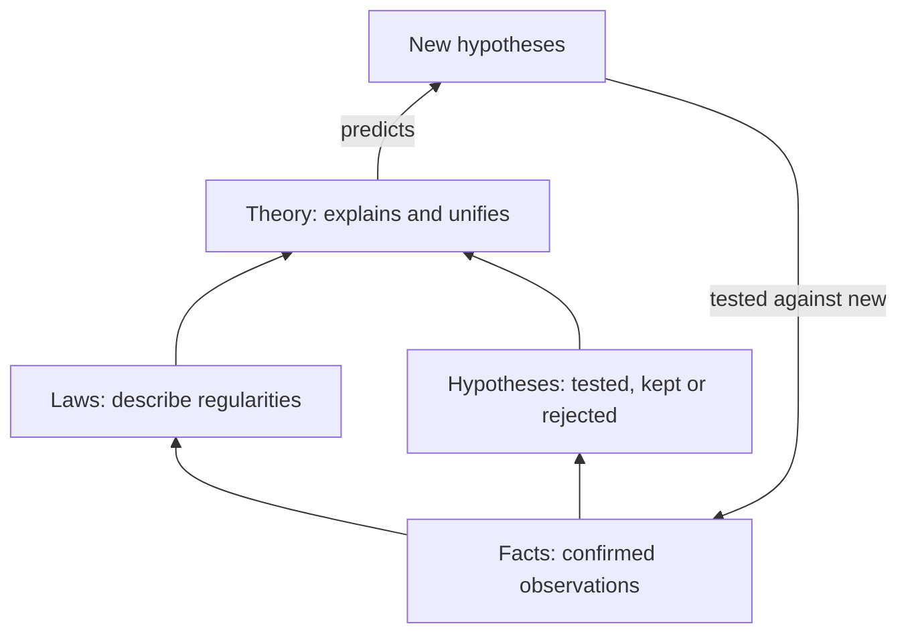

---
aliases:
  - Theory
  - Scientific Law
  - Théorie scientifique
tags:
  - type/concept
  - domain/scientific-practice
  - domain/biology
  - level/L1
  - level/L2
  - level/L3
mastery: 0
prerequisites:
  - "[[Hypothesis]]"
  - "[[Inductive Reasoning]]"
  - "[[Falsifiability]]"
related:
  - "[[Empirical Evidence]]"
  - "[[Scientific Model]]"
  - "[[Paradigm Shift]]"
  - "[[Mendelian Inheritance]]"
projects:
  - "[[07-evolution-simulator]]"
sources:
  - "[[Science, Evolution, and Creationism (National Academies)]]"
  - "[[Biology 2e (OpenStax)]]"
  - "[[Molecular Biology of the Cell (Alberts)]]"
  - "[[On the Origin of Species (Darwin)]]"
  - "[[Mendel 1866 - Experiments in Plant Hybridization]]"
  - "[[Theobald 2010 - A Formal Test of the Theory of Universal Common Ancestry]]"
  - "[[The Logic of Scientific Discovery (Popper)]]"
---

# Scientific Theory

> [!abstract]
> In science a theory is not a guess: it is a broad, well-tested explanation that ties many facts, laws and confirmed hypotheses together, as cell theory and the theory of evolution do for biology.

## Definition

A **scientific theory** is a comprehensive explanation of some aspect of nature that is supported by a vast body of evidence;[^nas] biology textbooks call it a thoroughly tested and confirmed explanation for a set of observations or phenomena.[^os1] It differs in kind from its neighbours:[^nas][^os1]

- a **fact** is an observation confirmed so often that it is accepted as true for practical purposes;
- a **hypothesis** is a tentative, testable explanation for a specific question ([[Hypothesis]]);
- a **law** is a description, often a mathematical formula, of how some aspect of nature behaves under stated circumstances.

In short, a law **describes** a regularity and a theory **explains** it.

## Why it matters

- **Methods rest on theories.** Reading sequence similarity as shared ancestry ([[BLAST]] searches, gene trees, annotation transfer between species) assumes [[Common Descent]]; substitution models and tests for selection apply evolutionary theory ([[Molecular Evolution]], [[Natural Selection]]); single-cell data take the cell as the unit of life ([[Cell]]).
- **Calibrating confidence.** The output of your pipeline is a hypothesis; the frameworks it relies on are theories. Overturning one takes far more evidence than the other.
- **Talking about science.** "Evolution is just a theory" mixes the everyday sense of theory (a hunch) with the scientific one.[^nas]

## Core (L1)

| Kind | What it does | Example from genetics |
|---|---|---|
| Fact | records a repeatedly confirmed observation | Mendel's self-fertilized hybrids gave 5,474 round and 1,850 wrinkled seeds[^mendel] |
| Hypothesis | proposes a testable explanation for one question | "gene X is needed for biofilm formation in this strain" (invented) |
| Law | describes a regularity, often as a formula | segregation: each gamete receives one of a gene's two alleles, with probability 1/2[^osu3] |
| Theory | explains many facts and laws by one mechanism | the chromosomal theory of inheritance: genes lie on chromosomes, whose behaviour in [[Meiosis]] produces Mendel's ratios[^osu3] |



Laws and theories are different kinds of statement, so neither turns into the other: no amount of evidence promotes a theory to a law, and a hypothesis does not become a theory by being confirmed once ([[Hypothesis]]). What a theory adds is reach: the chromosomal theory explains segregation, independent assortment **and** its exceptions (Exercise 3).

## Deeper (L2)

**Cell theory.** It states that all living things are made of one or more cells, that the cell is the basic unit of life, and that new cells arise from existing cells; Schleiden and Schwann proposed it in the late 1830s and Virchow later contributed to it.[^os41] It is a theory in the strong sense because it:

- **unifies**: every cell stores its hereditary information in DNA, transcribes it into RNA, translates RNA into protein by the same machinery and is bounded by a plasma membrane;[^alberts1]
- **explains** growth (cells divide), reproduction and the continuity of heredity from cell to cell ([[Cell]], [[Mitosis]]);
- **forbids** observations: a cell assembling from non-living material under present conditions would refute its third statement. Viruses are acellular but replicate only inside host cells,[^osvir] so they depend on cells rather than contradict the theory ([[Virus]]).

**The theory of evolution.** Darwin argued in 1859 that species descend with modification from common ancestors and that natural selection is the main cause of that modification.[^darwin] Two layers are worth separating. The **occurrence** of evolution is supported so strongly that scientists treat it as a fact; the **theory** explains how it happens and continues to be refined.[^nas] The evidence comes from independent lines that agree: fossil succession, geographical distribution, classification in nested groups,[^darwin] and molecular sequences, where a formal test favoured universal common ancestry over independent origins by a very large margin.[^theobald] The theory is falsifiable ([[Falsifiability]]) and has grown: the *Origin* (1859) predates Mendel's paper (1866),[^darwin][^mendel] so genetics, population genetics and molecular evolution were added later without overturning descent with modification ([[Evolution]]).

## Advanced (L3)

- **Corroborated, never proved.** For Popper, a theory cannot be verified by any number of confirmations; it is corroborated by surviving tests that could have refuted it.[^popper] Strong theories have survived many such tests; their status remains provisional in principle, not weak in practice.
- **How theories change.** Anomalies are first handled with auxiliary assumptions, which should themselves be testable;[^popper] whether and when a theory is replaced is the subject of [[Paradigm Shift]].
- **Theory, model, algorithm.** A theory becomes quantitative through [[Scientific Model|models]] that simplify it on purpose ([[Hardy-Weinberg Equilibrium]], [[Wright-Fisher Model]], [[Jukes-Cantor Model]]), and bioinformatics turns models into algorithms (tree building, tests for selection). A model can fail in its simplifications while the theory stands.
- **Names mislead.** "Law" and "theory" in names are historical labels: Mendel's law of independent assortment fails for linked genes,[^osu3] so a "law" can be narrower than a "theory". Judge a claim by its evidence, not its label.

## Mathematical representation

A theory is not a single formula. In the hypothetico-deductive view, a theory $T$ together with auxiliary assumptions $A$ entails observable consequences $O$: $T \wedge A \models O$ ([[Deductive Reasoning]]). Laws are often the formulas: segregation gives $P(\text{gamete carries } R) = \tfrac{1}{2}$, so a cross $Rr \times Rr$ yields the recessive phenotype with probability $\left(\tfrac{1}{2}\right)^2 = \tfrac{1}{4}$ and the 3:1 ratio. For two loci with recombination fraction $r \in [0, \tfrac{1}{2}]$, independent assortment is the special case $r = \tfrac{1}{2}$.

## Computational representation

The code encodes only the mechanism (one random allele per gamete) and lets the law emerge, which is the relation of theory to law.

```python
import random
from collections import Counter

rng = random.Random(1866)

def gamete(genotype: str) -> str:
    """Mechanism (chromosomes separate in meiosis): one of the two alleles, probability 1/2 each."""
    return rng.choice(genotype)

def f2_phenotypes(n: int) -> Counter:
    """n offspring of Rr x Rr; R (round) is dominant over r (wrinkled)."""
    return Counter("round" if "R" in gamete("Rr") + gamete("Rr") else "wrinkled" for _ in range(n))

sim = f2_phenotypes(7324)  # same total as Mendel's seed-shape F2
print(dict(sim), round(sim["round"] / sim["wrinkled"], 2))
print("Mendel 1866:", {"round": 5474, "wrinkled": 1850}, round(5474 / 1850, 2))
```

```text
{'round': 5460, 'wrinkled': 1864} 2.93
Mendel 1866: {'round': 5474, 'wrinkled': 1850} 2.96
```

Both ratios scatter around 3:1, the simulated one by chance alone ([[Mendelian Inheritance]] tests the fit).

## Worked example

> [!example] Classifying statements
> 1. "Mendel counted 5,474 round and 1,850 wrinkled F2 seeds." A recorded observation: **fact** (data).
> 2. "In a cross of two heterozygotes for one gene with complete dominance, phenotypes appear in a 3:1 ratio." Describes a regularity under stated conditions: **law**.
> 3. "Homologous chromosomes separate in meiosis, and that is why the 3:1 ratio appears." Explains the law by a mechanism that also covers other laws: **theory** (chromosomal theory of inheritance).
> 4. "Knocking down gene X will reduce invasion in this cell line." Specific, testable, not yet tested: **hypothesis**.

## Common misconceptions

> [!warning] "It's just a theory"
> In everyday speech a theory is a guess; in science it is the most comprehensive and best-supported kind of explanation.[^nas]

> [!warning] "Hypotheses become theories, and theories become laws"
> They are different kinds of statement: a law describes, a theory explains. Evidence makes each better supported; it does not change its kind.

> [!warning] "A law has no exceptions"
> Laws hold under stated circumstances. Independent assortment fails for linked genes,[^osu3] and the chromosomal theory says why (Exercise 3).

## Exercises

> [!question] Exercise 1 (L1)
> Classify as fact, hypothesis, law or theory: (a) "the 12 cultures grown at 42 °C reached a lower final density than the 12 grown at 37 °C" (invented); (b) "species descend with modification from common ancestors"; (c) "the high-temperature effect is due to misfolding of enzyme Y"; (d) "a testcross of a heterozygote gives the two phenotypes in a 1:1 ratio".

> [!success]- Solution
> (a) Fact (an observation of this experiment). (b) Theory, the core of evolutionary theory ([[Common Descent]]). (c) Hypothesis: specific and testable. (d) Law: a description that follows from segregation, under stated conditions.

> [!question] Exercise 2 (L2)
> State an observation that would refute "new cells arise from existing cells". Why do viruses not refute it, and why does the origin of the first cells, billions of years ago, not either?

> [!success]- Solution
> A cell forming from non-living components under present conditions. Viruses are not cells and replicate only inside cells,[^osvir] so they confirm the dependence on cells. The theory describes how life works now; how the first cells arose is a separate question, and a theory has a scope, like a law's stated circumstances.

> [!question] Exercise 3 (L3, Python)
> A doubly heterozygous parent $AB/ab$ is testcrossed with $ab/ab$. Write a function giving the expected offspring classes out of 1,000 for a recombination fraction $r$, and compare $r = 0.5$, $0.2$ and $0.05$. Which value reproduces Mendel's law of independent assortment, and what does the chromosomal theory say about the others?

> [!success]- Solution
> ```python
> def testcross(r: float, n: int = 1000) -> dict[str, float]:
>     """Expected offspring of AB/ab x ab/ab, recombination fraction r between the loci."""
>     return {"AB": n * (1 - r) / 2, "ab": n * (1 - r) / 2, "Ab": n * r / 2, "aB": n * r / 2}
>
> for r in (0.5, 0.2, 0.05):
>     print(r, testcross(r))
> ```
> ```text
> 0.5 {'AB': 250.0, 'ab': 250.0, 'Ab': 250.0, 'aB': 250.0}
> 0.2 {'AB': 400.0, 'ab': 400.0, 'Ab': 100.0, 'aB': 100.0}
> 0.05 {'AB': 475.0, 'ab': 475.0, 'Ab': 25.0, 'aB': 25.0}
> ```
> Only $r = 0.5$ gives the 1:1:1:1 of independent assortment. Genes on one chromosome stay together unless a crossover separates them, so parental classes dominate and the closer the genes, the smaller $r$ ([[Genetic Linkage]]).[^osu3] The law is the special case; the theory covers the general one.

## Mastery checklist

- [ ] 1 Recognized: I can define fact, hypothesis, law and theory in the scientific sense.
- [ ] 2 Understood: I can explain why laws and theories are different kinds of statement and why "just a theory" is a confusion.
- [ ] 3 Practiced: I can state cell theory and evolutionary theory, list their evidence and name observations that would refute them.
- [ ] 4 Applied: in [[07-evolution-simulator]], I can say which parts of a run encode evolutionary theory and which are simplifying model choices.
- [ ] 5 Explained: I can teach how a theory explains its laws and their exceptions, and why corroboration is not proof.

## References

[^nas]: [[Science, Evolution, and Creationism (National Academies)]], part on the nature of science (definitions of fact, hypothesis, law and theory; the occurrence of evolution as a fact).
[^os1]: [[Biology 2e (OpenStax)]], ch. 1 "The Study of Life", section 1.1 "The Science of Biology" (scientific theory and scientific law; hypotheses).
[^osu3]: [[Biology 2e (OpenStax)]], Unit 3 "Genetics" (Mendel's laws, the chromosomal theory of inheritance, linked genes).
[^os41]: [[Biology 2e (OpenStax)]], section 4.1 "Studying Cells" (history of the cell theory and its three statements).
[^osvir]: [[Biology 2e (OpenStax)]], chapter "Viruses" (viruses as acellular entities that replicate only inside host cells).
[^alberts1]: [[Molecular Biology of the Cell (Alberts)]], 4th ed. (2002), ch. 1 "Cells and Genomes", section "The Universal Features of Cells on Earth".
[^darwin]: [[On the Origin of Species (Darwin)]], 1st ed. (1859).
[^mendel]: [[Mendel 1866 - Experiments in Plant Hybridization]], monohybrid F2 counts for seed shape.
[^theobald]: [[Theobald 2010 - A Formal Test of the Theory of Universal Common Ancestry]], Theobald DL, *Nature* 465(7295):219-222.
[^popper]: [[The Logic of Scientific Discovery (Popper)]], parts on testing theories and corroboration.
