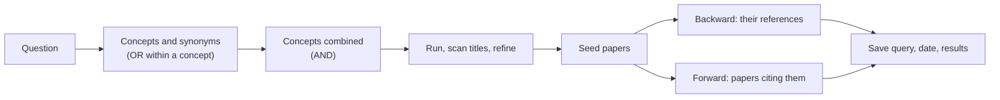

---
aliases:
  - Bibliographic Search
  - Literature Searching
  - Citation Chaining
  - Recherche bibliographique
tags:
  - type/concept
  - domain/scientific-practice
  - domain/bioinformatics
  - level/L1
  - level/L2
  - level/L3
mastery: 0
prerequisites:
  - "[[Primary Literature]]"
  - "[[Review Article]]"
  - "[[Set]]"
  - "[[Propositional Logic]]"
related:
  - "[[Medical Subject Headings]]"
  - "[[Reading a Scientific Paper]]"
  - "[[Reference Management]]"
  - "[[Systematic Review]]"
  - "[[Graph]]"
  - "[[Graph Traversal]]"
  - "[[Data Serialization]]"
projects: []
sources:
  - "[[PubMed]]"
  - "[[Europe PMC]]"
  - "[[NCBI E-utilities]]"
  - "[[Gusenbauer 2020 - Which Academic Search Systems Are Suitable for Systematic Reviews or Meta-Analyses]]"
  - "[[Keshav 2007 - How to Read a Paper]]"
  - "[[Python Documentation]]"
---

# Literature Search

> [!abstract]
> A literature search turns a question into queries (keywords joined by AND, OR, NOT) run in PubMed, Europe PMC or Google Scholar, then grows the result by following the references of good papers backward and the papers that cite them forward.

## Definition

A **literature search** finds the publications relevant to a question by querying bibliographic databases and search engines with keywords combined by **Boolean operators**, and by **citation chaining**: following a relevant paper's references (backward, toward older work) and the papers that cite it (forward, toward newer work). Its quality is measured by **precision** (how much of what you found is relevant), **recall** (how much of what is relevant you found) and **reproducibility** (whether the same query gives the same result).[^gusenbauer]

## Why it matters

- Before implementing a method, check whether it exists; before choosing a tool, find its paper and its benchmarks.
- Every claim in this vault needs a source, so every concept note starts with a search ([[Conventions]]).
- A scripted search through the E-utilities is a recorded, rerunnable step, like a data download in a pipeline.[^eutils]

## Core (L1)

| System | Content | Strengths | Limits |
|---|---|---|---|
| [[PubMed]] | over 40 million citations and abstracts in biomedicine and the life sciences; MEDLINE indexed with MeSH[^pubmed] | field tags, controlled vocabulary, free API | abstracts only (links to full text) |
| [[Europe PMC]] | over 42 million abstracts and over 9 million full-text articles, including preprints[^epmc] | full-text search, preprints, APIs | overlaps with PubMed: search both and merge |
| Google Scholar | multidisciplinary search engine | a starting point for a quick survey[^keshav] | not suitable as the principal system of a systematic search[^gusenbauer] |

**PubMed query syntax.**[^pmguide]

- **Boolean operators** `AND`, `OR`, `NOT` must be in capitals; lowercase operators are replaced by `AND`, the default.
- **Field tags** in square brackets restrict a term: `[ti]` title, `[tiab]` title or abstract, `[au]` author, `[ta]` journal, `[mh]` MeSH term ([[Medical Subject Headings]]).
- **Quotes** search a phrase, **parentheses** group terms. Untagged terms go through automatic term mapping, which adds related terms.



**Citation chaining.** Keshav's recipe for surveying a new field: find a few recent papers with a search engine, read them quickly, and look for the citations they share and the authors who recur; those are the key papers and groups.[^keshav]

## Deeper (L2)

- **Precision against recall.** `AND` and `NOT` raise precision and lower recall; `OR` does the opposite. A systematic search favors recall, then screens by hand ([[Systematic Review]]).
- **`NOT` is dangerous.** `NOT mouse[tiab]` also removes papers studying human *and* mouse. Exclude only what you have inspected.
- **Controlled vocabulary.** Free-text terms miss synonyms; MeSH indexing groups them under one heading ([[Medical Subject Headings]], Stage 2).
- **Record the search.** Databases grow daily, so a query reproduces only if its text, database and date are saved; reproducibility is one of the qualities on which search systems differ most.[^gusenbauer]

## Advanced (L3)

**Programmatic search.** The E-utilities are nine server-side programs reached by URLs starting with `https://eutils.ncbi.nlm.nih.gov/entrez/eutils/`. **ESearch** turns a query into a list of record IDs; **EFetch** turns a list of IDs into records in a chosen format. Above 3 requests per second, add an `api_key` parameter.[^eutils] Libraries such as `Bio.Entrez` build the same URLs.[^pubmed]

**Chaining as graph traversal.** Papers are the vertices of a directed [[Graph]], with an edge $p \to q$ when $p$ cites $q$. Backward chaining follows out-edges, forward chaining follows in-edges, and a breadth-first search to depth $k$ ([[Graph Traversal]]) collects every paper within $k$ citation steps.

## Mathematical representation

Let $D$ be the set of records and $R(t) \subseteq D$ the records matched by term $t$. Boolean operators are set operations ([[Set]], [[Propositional Logic]]):

$$R(a \text{ AND } b) = R(a) \cap R(b), \quad R(a \text{ OR } b) = R(a) \cup R(b), \quad R(a \text{ NOT } b) = R(a) \setminus R(b).$$

With $G \subseteq D$ the (unknown) set of relevant records and $R$ the result, precision $= |R \cap G| / |R|$ and recall $= |R \cap G| / |G|$. Counts combine by inclusion-exclusion: $|R(a) \cup R(b)| = |R(a)| + |R(b)| - |R(a) \cap R(b)|$. Citations mostly point back in time, so the citation graph is nearly acyclic; companion papers and updated preprints can still create cycles, so a traversal keeps a set of visited papers.

## Computational representation

`urllib.parse.urlencode` percent-encodes brackets and quotes and turns spaces into `+`; never assemble such URLs by string concatenation.[^python] The network was blocked where this note was written, so the URLs are shown and no results are claimed: open one in a browser or with `urllib.request.urlopen`, and parse the JSON with `json.loads` ([[Data Serialization]]).

```python
from urllib.parse import urlencode

EUTILS = "https://eutils.ncbi.nlm.nih.gov/entrez/eutils/"

def eutils_url(tool: str, **params) -> str:
    """URL of one E-utility call; parameters set to None are left out."""
    query = urlencode({k: v for k, v in params.items() if v is not None})
    return f"{EUTILS}{tool}.fcgi?{query}"

term = "Meselson M[au] AND Stahl FW[au] AND replication[ti]"
print(eutils_url("esearch", db="pubmed", term=term, retmax=20, retmode="json"))  # query -> IDs
print(eutils_url("efetch", db="pmc", id="528642", retmode="xml"))  # IDs -> records (PMC528642)
```

```text
https://eutils.ncbi.nlm.nih.gov/entrez/eutils/esearch.fcgi?db=pubmed&term=Meselson+M%5Bau%5D+AND+Stahl+FW%5Bau%5D+AND+replication%5Bti%5D&retmax=20&retmode=json
https://eutils.ncbi.nlm.nih.gov/entrez/eutils/efetch.fcgi?db=pmc&id=528642&retmode=xml
```

Citation chaining on a toy graph (invented papers P1 to P7):

```python
from collections import deque

REFS = {"P1": ["P2", "P3"], "P2": ["P4"], "P3": ["P4", "P5"], "P4": [], "P5": [],
        "P6": ["P1", "P3"], "P7": ["P6", "P2"]}       # paper -> its references (invented)
CITED_BY = {p: [q for q, refs in REFS.items() if p in refs] for p in REFS}

def chain(seed: str, graph: dict[str, list[str]], depth: int) -> dict[str, int]:
    """Breadth-first search from seed, at most depth steps: paper -> distance."""
    dist, queue = {seed: 0}, deque([seed])
    while queue:
        paper = queue.popleft()
        for nxt in graph[paper] if dist[paper] < depth else []:
            if nxt not in dist:
                dist[nxt] = dist[paper] + 1
                queue.append(nxt)
    return {p: d for p, d in dist.items() if p != seed}

print("backward from P1:", chain("P1", REFS, 2))
print("forward from P1: ", chain("P1", CITED_BY, 2))
```

```text
backward from P1: {'P2': 1, 'P3': 1, 'P4': 2, 'P5': 2}
forward from P1:  {'P6': 1, 'P7': 2}
```

## Worked example

> [!example] From a question to a query (toy result sets)
> Question: how has RNA-seq been used in yeast? Concepts: *RNA-seq*; *yeast*, with the synonym *Saccharomyces*.
> 1. Query: `"RNA-Seq"[tiab] AND (yeast[tiab] OR Saccharomyces[tiab])`.
> 2. Evaluate Boolean combinations on invented result sets with Python's set operators:
> ```python
> rnaseq, yeast, review = {101, 102, 103, 104, 105}, {104, 105, 106}, {103, 105, 107}
> print("rnaseq AND yeast            ", sorted(rnaseq & yeast))
> print("(rnaseq AND yeast) NOT review", sorted((rnaseq & yeast) - review))
> print("rnaseq AND (yeast OR review)", sorted(rnaseq & (yeast | review)))
> print("(rnaseq AND yeast) OR review", sorted((rnaseq & yeast) | review))
> ```
> ```text
> rnaseq AND yeast             [104, 105]
> (rnaseq AND yeast) NOT review [104]
> rnaseq AND (yeast OR review) [103, 104, 105]
> (rnaseq AND yeast) OR review [103, 104, 105, 107]
> ```
> 3. The last two lines differ only by parentheses: grouping changes the set, so always write the parentheses.
> 4. Take the relevant hits as seeds, chain backward and forward, and save the query with its date.

## Common misconceptions

> [!warning] "Google Scholar finds everything, so it is enough"
> Coverage is not the only criterion: for systematic searches it lacks the precision and reproducibility needed and is not suitable as the principal system.[^gusenbauer] Use PubMed or Europe PMC as the main systems.

> [!warning] "Lowercase operators work the same"
> In PubMed, lowercase operators are replaced by `AND`:[^pmguide] `rna-seq not mouse` searches for papers containing *both* terms, the opposite of the intent.

## Exercises

> [!question] Exercise 1 (L1)
> Write a PubMed query for papers by S. F. Altschul with BLAST in the title, and one for papers with "gene expression" in the title or abstract published in *Genome Biology*.

> [!success]- Solution
> `Altschul SF[au] AND BLAST[ti]`; `"gene expression"[tiab] AND "Genome Biology"[ta]`. Tags restrict each term to one field; quotes keep the phrase together.[^pmguide]

> [!question] Exercise 2 (L2)
> A query returns 50 records, 20 of them relevant; you know of 40 relevant records in total. Give precision and recall. Then, with $|R(a)| = 1200$, $|R(b)| = 300$ and $|R(a \text{ AND } b)| = 80$, give $|R(a \text{ OR } b)|$.

> [!success]- Solution
> Precision $20/50 = 0.4$, recall $20/40 = 0.5$. By inclusion-exclusion, $1200 + 300 - 80 = 1420$.

> [!question] Exercise 3 (L3, Python)
> Keshav's survey heuristic looks for references shared by several recent papers. Given three reference lists (invented), `R1: A B C D`, `R2: B C E`, `R3: C D F B`, find the references cited by at least two of them.

> [!success]- Solution
> ```python
> from collections import Counter
> reading_list = {"R1": ["A", "B", "C", "D"], "R2": ["B", "C", "E"], "R3": ["C", "D", "F", "B"]}
> counts = Counter(ref for refs in reading_list.values() for ref in refs)
> print([(ref, n) for ref, n in counts.most_common() if n >= 2])
> ```
> Output: `[('B', 3), ('C', 3), ('D', 2)]`. B and C are cited by all three: read them first. In graph terms, this is the in-degree of each reference within the subgraph of your seed papers.

## Mastery checklist

- [ ] 1 Recognized: I can name PubMed, Europe PMC and Google Scholar and what each is good for.
- [ ] 2 Understood: I can explain Boolean operators as set operations, field tags, precision and recall.
- [ ] 3 Practiced: I can write a tagged, parenthesized query and chain backward and forward from a seed paper.
- [ ] 4 Applied: I scripted an ESearch and EFetch query for a Lab project and saved the query, date and IDs with the results.
- [ ] 5 Explained: I can explain why Google Scholar is not a principal system for systematic searches, and why saving queries matters.

## References

[^pubmed]: [[PubMed]], About page (size, scope, MEDLINE and MeSH) and "How to use it" (`Bio.Entrez`).
[^pmguide]: [[PubMed]], PubMed User Guide: Boolean operators, search field tags, automatic term mapping.
[^epmc]: [[Europe PMC]], "Europe PMC in 2023", *Nucleic Acids Research* 52(D1):D1668 (2024).
[^eutils]: [[NCBI E-utilities]], "A General Introduction to the E-utilities".
[^gusenbauer]: [[Gusenbauer 2020 - Which Academic Search Systems Are Suitable for Systematic Reviews or Meta-Analyses]], *Research Synthesis Methods*.
[^keshav]: [[Keshav 2007 - How to Read a Paper]], section on doing a literature survey.
[^python]: [[Python Documentation]], Library Reference, `urllib.parse`.
