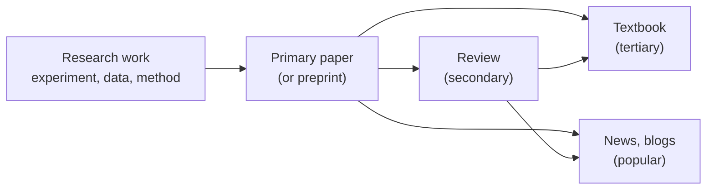

---
aliases:
  - Primary Source
  - Primary Research Article
  - Original Research Article
  - Littérature primaire
tags:
  - type/concept
  - domain/scientific-practice
  - level/L1
  - level/L2
mastery: 0
prerequisites:
  - "[[Empirical Evidence]]"
  - "[[Hypothesis]]"
related:
  - "[[Scientific Paper]]"
  - "[[Review Article]]"
  - "[[Literature Search]]"
  - "[[Peer Review]]"
  - "[[Preprint]]"
  - "[[Hierarchy of Evidence]]"
  - "[[Biological Database]]"
projects: []
sources:
  - "[[Coursera Stanford - Writing in the Sciences]]"
  - "[[Pautasso 2013 - Ten Simple Rules for Writing a Literature Review]]"
  - "[[Watson 1953 - Molecular Structure of Nucleic Acids]]"
  - "[[Meselson 1958 - The Replication of DNA in Escherichia coli]]"
  - "[[Nurk 2022 - The Complete Sequence of a Human Genome]]"
  - "[[Wang 2009 - RNA-Seq - A Revolutionary Tool for Transcriptomics]]"
  - "[[Shendure 2008 - Next-Generation DNA Sequencing]]"
  - "[[Molecular Biology of the Cell (Alberts)]]"
  - "[[Europe PMC]]"
  - "[[NCBI]]"
  - "[[Sandve 2013 - Ten Simple Rules for Reproducible Computational Research]]"
  - "[[European Nucleotide Archive]]"
---

# Primary Literature

> [!abstract]
> Primary literature is where a result first appears, told by the people who obtained it; reviews, textbooks and news are retellings, and each retelling loses detail.

## Definition

The **primary literature** is the set of publications in which researchers report their own new work for the first time (an experiment, an observation, a dataset, a method or a piece of software) with the methods and results needed to evaluate it. A **review article** summarizes and evaluates many primary papers instead of reporting new work; the original research manuscript and the review are distinct genres.[^sciwrite] Reviews exist because no scientist can read every new paper in a field.[^pautasso]

This vault uses three words for the chain of retellings: **primary** (the original report), **secondary** (reviews and other syntheses of primary papers), **tertiary** (textbooks and encyclopedias, which condense what a field already agrees on). **Popular** sources (news, blogs, videos) retell results for non-specialists.

## Why it matters

- **Methods and tools.** To use or cite BLAST, you go to the paper that introduced it, [[Altschul 1990 - Basic Local Alignment Search Tool]]: its assumptions, parameters and benchmarks are there, not in a textbook summary.
- **Data.** Raw data behind a paper are found through the accessions in its data availability statement ([[Accession Number]]); they lead to a primary archive such as ENA.[^ena]
- **Checking a claim.** A textbook sentence compresses several papers and drops their conditions. The primary paper tells you what was measured, in which organism, on how many samples.
- **This vault.** [[Conventions]] ask for primary literature when citing historical or landmark results; the papers in `90-Sources/Papers/` mix primary papers, reviews and guidelines, so classify a paper before citing it.

## Core (L1)

| Type | Written by | What is new in it | Example in this vault | Use it to |
|---|---|---|---|---|
| Primary research article | the people who did the work | data, results, a method or software | [[Meselson 1958 - The Replication of DNA in Escherichia coli]][^meselson] | check what was shown; cite a result or method |
| Review article | experts of the field | the synthesis and the authors' interpretation | [[Wang 2009 - RNA-Seq - A Revolutionary Tool for Transcriptomics]][^wang] | enter a field; find the key primary papers ([[Review Article]]) |
| Textbook | authors condensing a field | organization and teaching | [[Molecular Biology of the Cell (Alberts)]] | learn the established basics |
| Popular source | journalists, communicators | accessibility | a news story on a new genome | hear about a result, then find the paper |

**Three questions classify most documents.**

1. Do the authors report work they did themselves, with a methods section describing their own experiments, data or code? Primary.
2. Is the content mainly a discussion of other people's papers, with a long reference list and no new data? Review.
3. Is it written to teach or to inform the public, with few references to specific papers? Textbook or popular source.

**Primary does not mean experimental.** Watson and Crick's 1953 letter reported no experiment of their own: it proposed a model, built with the X-ray results of Franklin's and Wilkins's groups, which were published as companion papers in the same issue.[^watson] The letter is the primary source for the *model*; the companion papers are the primary sources for the *diffraction data*. Method, software and genome papers are primary too: [[Nurk 2022 - The Complete Sequence of a Human Genome]] reports a new assembly.[^nurk]

## Deeper (L2)

**Grey zones.**

- **Preprints** are primary papers posted before peer review; Europe PMC indexes them next to journal articles.[^epmc] Being primary says *who produced* the result; [[Peer Review]] says *whether others checked it*. The two are independent ([[Preprint]]).
- **Systematic reviews and meta-analyses** are secondary (they reuse published studies) but produce new quantitative results with an explicit, repeatable method ([[Systematic Review]], [[Meta-Analysis]]).
- **Resource papers.** NCBI describes its databases in a yearly paper of the *Nucleic Acids Research* database issue.[^ncbi] Such a paper is the primary description of the resource: cite it when you use the resource.
- **Guidelines and perspectives.** A "Ten simple rules" article such as [[Sandve 2013 - Ten Simple Rules for Reproducible Computational Research]] gives practical rules, not new data and not a survey of studies.[^sandve] Treat it as expert guidance.

**The same split exists in databases.** A primary archive (GenBank, ENA) stores data as submitted by the people who produced them; a curated knowledge base (RefSeq) derives reference records from them ([[Biological Database]]). The trade-off is identical: primary is closest to the evidence but raw and redundant; secondary is cleaner but filtered through someone's choices.

**Type is not strength.** A primary paper can be a single small experiment or a large randomized trial. How strongly a study supports a claim depends on its design, which [[Hierarchy of Evidence]] ranks, and on its execution, which [[Critical Appraisal]] judges.

## Computational representation

Nothing to compute: the distinction is about who produced a result and where it was first reported. In practice it becomes a choice of query in [[Literature Search]] and a field you record in [[Reference Management]].

## Worked example

> [!example] Tracing one textbook number to its primary source
> The [[DNA]] note gives two values for the B-DNA helix: 10 and 10.4 base pairs per turn.
> 1. **Textbook (tertiary):** measured in solution, B-DNA has about 10.4 base pairs per turn.[^alberts]
> 2. **Primary paper:** the 1953 model repeats after 10 residues per chain, every 34 Å.[^watson]
> 3. **Reading the difference:** no contradiction. The 1953 value is a model fitted to X-ray data of the time; the textbook gives the later measured value in solution.
> 4. **Lesson:** the textbook alone hides where the number came from; the primary paper alone is out of date. Cite each for what it actually supports: the model for the history, the textbook for the current value.

## Common misconceptions

> [!warning] "Peer reviewed means primary"
> Reviews are peer reviewed too, and preprints are primary without being peer reviewed. "Primary" and "peer reviewed" answer two different questions.

> [!warning] "A review is stronger than a single paper because it covers many studies"
> A narrative review reports its authors' selection and interpretation, and authors who published on the topic may overstate their own findings.[^pautasso] Strength comes from a declared, systematic method, not from the label "review" ([[Review Article]]).

> [!warning] "Primary literature means wet-lab experiments"
> Models (Watson 1953), algorithms (Altschul 1990), software and genome assemblies (Nurk 2022) are primary literature when they are reported for the first time by their authors.

## Exercises

> [!question] Exercise 1 (L1)
> Classify as primary, review, textbook or popular: (a) Meselson 1958; (b) Shendure 2008, "Next-generation DNA sequencing"; (c) *Biology 2e* (OpenStax); (d) a newspaper article on the first complete human genome; (e) Nurk 2022.

> [!success]- Solution
> (a) Primary: the authors report their own density-labeling experiment.[^meselson] (b) Review: it surveys sequencing platforms developed by others.[^shendure] (c) Textbook. (d) Popular: it retells (e). (e) Primary: the authors report the assembly they produced.[^nurk] For (d), the useful move is to find (e) and read it.

> [!question] Exercise 2 (L1)
> A report cites Wang 2009 for the sentence "RNA-Seq was used to map mammalian transcriptomes". What is weak about this citation, and how do you fix it?

> [!success]- Solution
> Wang 2009 is a review:[^wang] it reports other people's results. Use its reference list to find the primary paper that did the mapping (for example check whether [[Mortazavi 2008 - Mapping and Quantifying Mammalian Transcriptomes by RNA-Seq]] is the one it cites for this point), read the relevant figure, and cite that paper. Cite the review only for an overview statement.

> [!question] Exercise 3 (L2)
> Place each item on two axes, primary or secondary, and peer reviewed or not: a bioRxiv preprint of a new read aligner; a meta-analysis published in a journal; the NCBI database-resources paper in *Nucleic Acids Research*; a "Ten simple rules" article.

> [!success]- Solution
> Preprint: primary, not (yet) peer reviewed. Meta-analysis: secondary, peer reviewed, with new pooled results. NCBI paper: primary description of a resource, published in a journal. "Ten simple rules": guidance, neither primary research nor a survey of studies, published in a journal. The two axes vary independently, which is the point.

> [!question] Exercise 4 (L2)
> For which claims would you cite Watson 1953, and for which would you need another primary paper?

> [!success]- Solution
> Cite it for the double-helix model with antiparallel chains and A-T, G-C pairing, and for the suggested copying mechanism.[^watson] The X-ray evidence is in the companion papers by Wilkins's group and by Franklin and Gosling; the experimental test of semiconservative copying is [[Meselson 1958 - The Replication of DNA in Escherichia coli]].[^meselson] A model paper states a hypothesis; the evidence is elsewhere.

## Mastery checklist

- [ ] 1 Recognized: I can define primary literature and name the other three kinds of source.
- [ ] 2 Understood: I can classify a document with the three questions, including models, methods and resource papers.
- [ ] 3 Practiced: I can place preprints, meta-analyses and guidelines on the primary/secondary and peer-reviewed axes.
- [ ] 4 Applied: every result I cite in a Lab README or concept note points to its primary paper, not to a review or textbook.
- [ ] 5 Explained: I can explain why a textbook value and a primary value differ, and what each source is good for.

## References

[^sciwrite]: [[Coursera Stanford - Writing in the Sciences]], modules "The manuscript" and "Other genres" (review papers).
[^pautasso]: [[Pautasso 2013 - Ten Simple Rules for Writing a Literature Review]], introduction and rule 9.
[^watson]: [[Watson 1953 - Molecular Structure of Nucleic Acids]], *Nature*.
[^meselson]: [[Meselson 1958 - The Replication of DNA in Escherichia coli]], *PNAS*.
[^nurk]: [[Nurk 2022 - The Complete Sequence of a Human Genome]], *Science*.
[^wang]: [[Wang 2009 - RNA-Seq - A Revolutionary Tool for Transcriptomics]], *Nature Reviews Genetics*.
[^shendure]: [[Shendure 2008 - Next-Generation DNA Sequencing]], *Nature Biotechnology*.
[^alberts]: [[Molecular Biology of the Cell (Alberts)]], 4th ed. (2002).
[^epmc]: [[Europe PMC]], "Europe PMC in 2023", *Nucleic Acids Research* (2024).
[^ncbi]: [[NCBI]], yearly database-resources paper in *Nucleic Acids Research*.
[^sandve]: [[Sandve 2013 - Ten Simple Rules for Reproducible Computational Research]], *PLoS Computational Biology*.
[^ena]: [[European Nucleotide Archive]].
