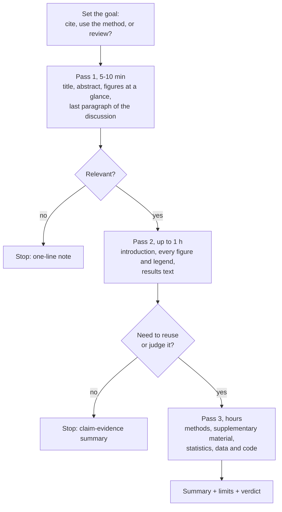

---
aliases:
  - Paper Reading
  - Three-Pass Approach
  - How to Read a Paper
  - Lire un article scientifique
tags:
  - type/concept
  - domain/scientific-practice
  - level/L1
  - level/L2
mastery: 0
prerequisites:
  - "[[Scientific Paper]]"
  - "[[Primary Literature]]"
  - "[[Empirical Evidence]]"
  - "[[Hypothesis]]"
related:
  - "[[Critical Appraisal]]"
  - "[[Literature Search]]"
  - "[[Review Article]]"
  - "[[Reference Management]]"
  - "[[Data Visualization]]"
  - "[[Confirmation Bias]]"
projects: []
sources:
  - "[[Keshav 2007 - How to Read a Paper]]"
  - "[[Coursera Stanford - Writing in the Sciences]]"
  - "[[Meselson 1958 - The Replication of DNA in Escherichia coli]]"
  - "[[Jumper 2021 - Highly Accurate Protein Structure Prediction with AlphaFold]]"
  - "[[Ioannidis 2005 - Why Most Published Research Findings Are False]]"
---

# Reading a Scientific Paper

> [!abstract]
> Read a paper in passes, from a five-minute look at the abstract and figures to a slow check of the methods, stop as soon as you know enough for your goal, and finish by writing down the claim and the evidence for it.

## Definition

Reading a paper efficiently means reading it in several **passes** of increasing depth instead of from the first word to the last, choosing how far to go from your goal. Keshav's **three-pass approach**: a first pass of about five to ten minutes gives a bird's-eye view; a second pass of up to an hour grasps the content but not the details; a third pass understands the paper in depth, as if re-implementing it.[^keshav] The output of reading is a short written **summary of the claim and its evidence**.

## Why it matters

- The literature is too large to read everything in full ([[Review Article]]); passes let you triage dozens of papers and go deep on a few.
- A bioinformatician reads two kinds of papers: biology papers, where the claim and its figures matter most, and method papers, where the methods and supplement decide whether the tool can be used.
- A written claim-evidence summary is what makes a reference reusable months later, in a note or a [[Reference Management|reference library]].

## Core (L1)

Keshav's passes come from computer science.[^keshav] For biology papers, where the evidence is mostly in figures and tables,[^sciwrite] this vault uses this order:



| Pass | You read | You can then write |
|---|---|---|
| 1 | title, abstract, figure titles, end of the discussion | the kind of paper and its main claim in one sentence |
| 2 | introduction, each figure with its legend, the results | which figure supports which claim, unknown terms, references to follow |
| 3 | methods, supplementary material, statistics | whether you could reproduce it, its assumptions, what is missing |

**The claim-evidence summary** (fill it after pass 2):

```text
Citation : authors, journal, year, DOI
Question : what gap does the paper address?
Claim    : the main conclusion, in one sentence
Evidence : which figure or table shows it, measured how, on how many samples
Method   : the key design choice (control, comparison, model)
Limits   : what the evidence does not cover (organism, conditions, sample size)
Verdict  : how far do I trust the claim, and for what use?
```

## Deeper (L2)

**Reading a figure.** For each figure: what is on each axis and in which units; what each point, bar or band is; how many samples; what the error bars are; which comparison the legend says matters; and whether the statement in the results text follows from what is drawn ([[Data Visualization]], [[P-Value]], [[Confidence Interval]]).

**Separate the evidence from the interpretation.** The results say what was observed; the discussion and the abstract say what the authors think it means. Typical gaps: a claim stated for "eukaryotes" from one yeast strain, or a causal verb ("controls") from a correlation ([[Causality]]). Keshav's third pass is explicitly about challenging every assumption.[^keshav]

**Be calibrated, not cynical.** A single significant result is weaker evidence than it looks when studies are small, the hypothesis was unlikely beforehand, or the analysis was flexible; under such conditions many claimed findings are false.[^ioannidis] The full method of judging a paper is [[Critical Appraisal]] (Stage 2).

**Method papers.** For a tool or algorithm, the third pass checks the benchmark data, the baselines compared, the parameters and the code availability. In the AlphaFold 2 paper the algorithm itself is in the supplementary information, so a method reader cannot stop at the main text.[^jumper]

## Computational representation

The claim-evidence summary is plain structured text: store it as the note attached to the reference in your library ([[Reference Management]]), so that it travels with the DOI.

## Worked example

> [!example] Three passes on Meselson and Stahl (1958)
> **Pass 1.** *PNAS* 44(7):671-682, free at PMC528642.[^meselson] Claim from the abstract and figures: DNA replication in *E. coli* is semiconservative. Relevant: continue.
>
> **Pass 2.** Design: bacteria grown on heavy nitrogen (¹⁵N) are shifted to light nitrogen (¹⁴N) and sampled over generations; DNA is separated by density in a cesium chloride gradient by ultracentrifugation. Result: one band of hybrid density after one generation, hybrid and light bands after two.[^meselson]
>
> Evidence against the alternatives (reasoning): a **conservative** model predicts heavy and light bands after one generation and no hybrid band; a **dispersive** model predicts a single band whose density drifts toward light, with no separate light band after two generations. Only the semiconservative model predicts both observations.
>
> **Summary.** Claim: each daughter duplex keeps one parental strand. Evidence: the band pattern after one and two generations. Method: density labeling, one decisive experiment against three models. Limits: it shows how strands are distributed, not the enzymes that copy them.[^meselson] Verdict: strong support for the claim as stated.

## Common misconceptions

> [!warning] "A paper is read from beginning to end"
> Linear reading spends the same time on everything. Passes spend minutes on papers you will drop and hours only on those you need.[^keshav]

> [!warning] "The abstract tells me what the paper shows"
> The abstract tells you what the authors claim. What the paper shows is in its figures and methods; check one against the other.

> [!warning] "Methods are for specialists, I can skip them"
> Methods come last, not never. For a bioinformatician the methods decide whether a result can be reused: versions, parameters, filters, sample sizes.

## Exercises

> [!question] Exercise 1 (L1)
> Order these actions by pass: check the statistical test of Fig. 3; read the abstract; note the accession of the raw data; read every figure legend; read the title; look up two unknown terms.

> [!success]- Solution
> Pass 1: title, abstract. Pass 2: every figure legend, look up the unknown terms. Pass 3: statistical test of Fig. 3, accession of the raw data (needed only if you reuse or check the data).

> [!question] Exercise 2 (L1)
> Do a first pass on [[Watson 1953 - Molecular Structure of Nucleic Acids]] in five minutes. Write its kind and its claim in one sentence each.

> [!success]- Solution
> Kind: a one-page letter proposing a model, without experiments of its own. Claim: DNA is a double helix of two antiparallel chains held by A-T and G-C pairs, which suggests a copying mechanism. See [[Scientific Paper#Worked example]] for the full dissection.

> [!question] Exercise 3 (L2)
> An abstract (invented) says: "Gene X controls the stress response in eukaryotes." The figures show one yeast strain, a knockout and a wild type, three replicates each, and a lower survival of the knockout under heat. List the gaps between claim and evidence.

> [!success]- Solution
> Scope: one strain of one species, not "eukaryotes". Stress: heat only, not "the stress response". Causality: a knockout supports a role, "controls" claims more. Power: three replicates give a fragile estimate. A fair claim: "Deleting X lowers heat survival in this yeast strain."

> [!question] Exercise 4 (L2)
> Write a claim-evidence summary of [[Jumper 2021 - Highly Accurate Protein Structure Prediction with AlphaFold]] after a second pass, and say what a third pass would require.

> [!success]- Solution
> Claim: a deep learning method predicts protein structures with atomic accuracy in many cases, even without a similar known structure. Evidence: the blind CASP14 assessment. Method: multiple sequence alignments and templates as input, Evoformer blocks and a structure module. Limits: single chains; low-confidence regions; a static model, not folding dynamics.[^jumper] A third pass means the supplementary information, where the algorithmic detail lives.

## Mastery checklist

- [ ] 1 Recognized: I can describe the three passes and what each produces.
- [ ] 2 Understood: I can explain why figures come early and methods last, and why methods are never skipped when results are reused.
- [ ] 3 Practiced: I can write a claim-evidence summary of a paper after a second pass.
- [ ] 4 Applied: I keep a summary for every paper cited in my Lab project notes, stored with its reference.
- [ ] 5 Explained: I can show the gap between an abstract's claim and a figure's evidence on a real paper, and judge it fairly.

## References

[^keshav]: [[Keshav 2007 - How to Read a Paper]], *ACM SIGCOMM Computer Communication Review*.
[^sciwrite]: [[Coursera Stanford - Writing in the Sciences]], module "The manuscript" (tables and figures).
[^meselson]: [[Meselson 1958 - The Replication of DNA in Escherichia coli]], *PNAS* 44(7):671-682.
[^jumper]: [[Jumper 2021 - Highly Accurate Protein Structure Prediction with AlphaFold]], *Nature* 596:583-589.
[^ioannidis]: [[Ioannidis 2005 - Why Most Published Research Findings Are False]], *PLoS Medicine*.
