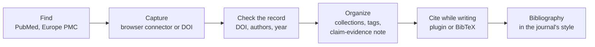

---
aliases:
  - Citation Management
  - Reference Manager
  - Bibliography Management
  - Gestion bibliographique
tags:
  - type/concept
  - domain/scientific-practice
  - level/L1
  - level/L2
  - level/L3
mastery: 0
prerequisites:
  - "[[Scientific Paper]]"
  - "[[Literature Search]]"
related:
  - "[[Persistent Identifier]]"
  - "[[Metadata]]"
  - "[[Regular Expression]]"
  - "[[Accession Number]]"
  - "[[Software Release]]"
  - "[[Scientific Writing]]"
  - "[[Plagiarism]]"
projects: []
sources:
  - "[[DOI Handbook]]"
  - "[[Zotero]]"
  - "[[Watson 1953 - Molecular Structure of Nucleic Acids]]"
  - "[[Meselson 1958 - The Replication of DNA in Escherichia coli]]"
  - "[[Sandve 2013 - Ten Simple Rules for Reproducible Computational Research]]"
  - "[[The Turing Way]]"
  - "[[Python Documentation]]"
---

# Reference Management

> [!abstract]
> Reference management means keeping one library of everything you read, each entry identified by its DOI, and producing every citation from that library in one style, instead of retyping references by hand.

## Definition

**Reference management** is the practice of storing each work you read or cite once, as a structured record (type, authors, title, venue, year, persistent identifier, your notes), in a single library, and generating citations and bibliographies from it in a consistent style. A **reference manager** is the software that does it; Zotero is a free, open-source one, administered by the nonprofit Corporation for Digital Scholarship.[^zotero] The key field is the **DOI** (Digital Object Identifier), a persistent identifier made of a prefix and a suffix separated by a slash.[^doi]

## Why it matters

- **Exactness.** A citation copied by hand accumulates errors; one generated from a checked record does not.
- **This vault is a reference library.** `90-Sources/` holds one note per source with its DOI in `url`, and every footnote points to that note ([[Conventions]]): the same discipline in plain text.
- **Data and software too.** Datasets and software releases receive DOIs and are cited like papers ([[Persistent Identifier]], [[Software Release]]); in a pipeline, the analog of a DOI is a versioned accession ([[Accession Number]]).

## Core (L1)

**Anatomy of a DOI.** Prefix = directory indicator `10`, a full stop, the registrant code; then `/`; then a suffix unique within that prefix. DOI names are case-insensitive.[^doi] Prefixing `https://doi.org/` gives the resolvable link used in this vault's source notes.

| DOI | Prefix | Suffix | Paper |
|---|---|---|---|
| `10.1038/171737a0` | `10.1038` | `171737a0` | [[Watson 1953 - Molecular Structure of Nucleic Acids]][^watson] |
| `10.1073/pnas.44.7.671` | `10.1073` | `pnas.44.7.671` | [[Meselson 1958 - The Replication of DNA in Escherichia coli]][^meselson] |
| `10.1371/journal.pcbi.1003285` | `10.1371` | `journal.pcbi.1003285` | [[Sandve 2013 - Ten Simple Rules for Reproducible Computational Research]][^sandve] |



Zotero captures references from web pages with its Connector extension (Firefox, Chrome, Edge, Safari), formats them in Citation Style Language (CSL) styles, more than 10,000 of them, and imports and exports bibliographic data, including BibTeX for LaTeX users.[^zotero]

**Rules for consistency.** One library; one record per work; a DOI in every record that has one; cite from the library, never by retyping; check each new record once against the publisher's page.

## Deeper (L2)

- **Deduplication.** The same paper arrives from PubMed, Europe PMC and a colleague's file with different capitalization. Because DOIs are case-insensitive,[^doi] lowercased DOIs are a reliable key.
- **BibTeX** stores a record as `@type{key, field = {value}, ...}`; the key is how a LaTeX document refers to it. A simple parser handles flat values but not nested braces (Exercise 3).
- **Style is a function.** Changing journals changes the style, not the library: the same record becomes a numbered reference in one journal and an author-year one in another.
- **Your notes belong to the record.** Store the claim-evidence summary of [[Reading a Scientific Paper]] with the reference, so the reason you cite it travels with it.

## Advanced (L3)

- **Cite versions of living resources.** A living book or database changes: The Turing Way asks to be cited through a specific release with its Zenodo DOI.[^turing] Cite software by version, data by accession and version.
- **Before submitting,** check that no cited paper has been retracted ([[Retraction]]) and whether cited preprints have since been published in a journal ([[Preprint]]).
- **Reproducible manuscripts** keep the bibliography as a versioned file next to the text and code ([[Research Compendium]]).

## Mathematical representation

A library is a set $L$ of records $r = (\text{type}, \text{key}, \text{fields})$. A citation style is a function $s : L \to \Sigma^*$ from records to strings; **consistency** means every citation in a document is $s(r)$ for one fixed $s$. Deduplication is the equivalence relation $r \sim r' \iff \nu(\mathrm{doi}(r)) = \nu(\mathrm{doi}(r'))$, where $\nu$ strips resolver prefixes and lowercases; the deduplicated library is the set of equivalence classes.

## Computational representation

DOI normalization with a [[Regular Expression|regular expression]], a one-entry BibTeX parser and one citation style, standard library only.[^python] The regular expression is deliberately narrower than the Handbook grammar: it accepts numeric registrant codes (as in every DOI cited above) and a suffix without spaces.

```python
import re

DOI_RE = re.compile(r"^10\.\d+(?:\.\d+)*/\S+$")   # practical check, not the full grammar
PREFIXES = ("https://doi.org/", "https://dx.doi.org/", "http://dx.doi.org/", "doi:")

def normalize_doi(text: str) -> str | None:
    """Strip a resolver or 'doi:' prefix, validate, lowercase (DOIs are case-insensitive)."""
    s = text.strip()
    for prefix in PREFIXES:
        if s.lower().startswith(prefix):
            s = s[len(prefix):].strip()
            break
    return s.lower() if DOI_RE.match(s) else None

for raw in ["https://doi.org/10.1073/pnas.44.7.671", "DOI:10.1371/journal.pcbi.1003285",
            "10.1038/ 171737a0", "PMC528642"]:
    print(f"{raw!r:40} -> {normalize_doi(raw)}")

BIB = """@article{watson1953,
  author = {Watson, J. D. and Crick, F. H. C.},
  title = {Molecular Structure of Nucleic Acids: A Structure for Deoxyribose Nucleic Acid},
  journal = {Nature}, year = {1953}, volume = {171}, number = {4356},
  pages = {737--738}, doi = {10.1038/171737a0}
}"""
ENTRY = re.compile(r"@(\w+)\s*\{\s*([^,\s]+)\s*,(.*)\}\s*$", re.S)
FIELD = re.compile(r"(\w+)\s*=\s*\{(.*?)\}\s*(?:,|$)", re.S)

def parse_bibtex(text: str) -> dict[str, str]:
    """Parse ONE BibTeX entry whose field values are in single braces."""
    kind, key, body = ENTRY.match(text.strip()).groups()
    fields = {name.lower(): " ".join(value.split()) for name, value in FIELD.findall(body)}
    return {"type": kind.lower(), "key": key, **fields}

def cite(e: dict[str, str]) -> str:
    """One house style for every reference ('Watson, J. D.' becomes 'Watson JD')."""
    names = [a.split(",") for a in e["author"].split(" and ")]
    authors = ", ".join(s.strip() + " " + "".join(c for c in g if c.isupper()) for s, g in names)
    return (f"{authors}. *{e['journal']}* {e['volume']}({e['number']}):"
            f"{e['pages'].replace('--', '-')} ({e['year']}). doi:{normalize_doi(e['doi'])}")

entry = parse_bibtex(BIB)
print(entry["key"], entry["type"], entry["doi"], len(entry))
print(cite(entry))
```

```text
'https://doi.org/10.1073/pnas.44.7.671'  -> 10.1073/pnas.44.7.671
'DOI:10.1371/journal.pcbi.1003285'       -> 10.1371/journal.pcbi.1003285
'10.1038/ 171737a0'                      -> None
'PMC528642'                              -> None
watson1953 article 10.1038/171737a0 10
Watson JD, Crick FHC. *Nature* 171(4356):737-738 (1953). doi:10.1038/171737a0
```

## Worked example

> [!example] From a BibTeX record to the vault's citation line
> 1. **Record:** the BibTeX entry above holds the metadata of Watson 1953: journal, volume, issue, pages, year, DOI.[^watson] The parser returns 10 items: type, key and 8 fields.
> 2. **Identifier:** `10.1038/171737a0` passes the check: prefix `10.1038`, suffix `171737a0`. A PMC identifier such as `PMC528642` is rejected: it identifies a full-text copy, not the work.
> 3. **One style:** `cite(entry)` gives `Watson JD, Crick FHC. *Nature* 171(4356):737-738 (1953). doi:10.1038/171737a0`, character for character the citation line of the Watson source note.
> 4. **Lesson:** the style lives in one function and the facts in one record. To switch to another journal's style, change the function, never the records.

## Common misconceptions

> [!warning] "A URL is as good as a DOI"
> Publisher URLs change with website redesigns; a DOI is a persistent identifier that resolves to the current location.[^doi] Store the DOI, derive the link.

> [!warning] "Two spellings of a DOI are two papers"
> DOI names are case-insensitive:[^doi] `10.1038/171737A0` and `10.1038/171737a0` are the same paper. Compare lowercased DOIs.

## Exercises

> [!question] Exercise 1 (L1)
> Split `10.1186/s13059-017-1215-1` (the DOI of [[Hasin 2017 - Multi-Omics Approaches to Disease]]) into directory indicator, registrant code and suffix.

> [!success]- Solution
> Directory indicator `10`, registrant code `1186`, hence prefix `10.1186`; suffix `s13059-017-1215-1`.[^doi] Suffixes mix letters, digits, dots and hyphens: never assume they are numeric.

> [!question] Exercise 2 (L2, Python)
> Three records (one invented duplicate) carry the DOIs `10.1038/171737a0`, `https://doi.org/10.1038/171737A0` and `doi:10.1073/pnas.44.7.671`. Deduplicate them with `normalize_doi`.

> [!success]- Solution
> ```python
> library = [
>     {"title": "Molecular structure of nucleic acids", "doi": "10.1038/171737a0"},
>     {"title": "MOLECULAR STRUCTURE OF NUCLEIC ACIDS", "doi": "https://doi.org/10.1038/171737A0"},
>     {"title": "The replication of DNA in Escherichia coli", "doi": "doi:10.1073/pnas.44.7.671"},
> ]
> unique = {}
> for ref in library:
>     unique.setdefault(normalize_doi(ref["doi"]), ref)
> print(len(library), "->", len(unique), sorted(unique))
> ```
> Output: `3 -> 2 ['10.1038/171737a0', '10.1073/pnas.44.7.671']`. Titles can differ in case or punctuation; the normalized DOI is the reliable key.

> [!question] Exercise 3 (L3, Python)
> The field regex of `parse_bibtex` breaks on `title = {Revisiting {DNA}, fifty years on}`. Show the failure and write a field reader that counts braces.

> [!success]- Solution
> ```python
> nested = "@article{x2000,\n  title = {Revisiting {DNA}, fifty years on},\n  year = {2000}\n}"
> body = ENTRY.match(nested).group(3)
> print(FIELD.findall(body))
>
> def read_fields(body: str) -> dict[str, str]:
>     """Read name = {value} pairs, counting braces so nested groups stay inside the value."""
>     start = re.compile(r"\s*,?\s*(\w+)\s*=\s*\{")
>     fields, i = {}, 0
>     while (m := start.match(body, i)):
>         depth, j = 1, m.end()
>         while depth:
>             depth += {"{": 1, "}": -1}.get(body[j], 0)
>             j += 1
>         fields[m.group(1).lower()] = body[m.end():j - 1]
>         i = j
>     return fields
>
> print(read_fields(body))
> ```
> Output: `[('title', 'Revisiting {DNA'), ('year', '2000')]`, then `{'title': 'Revisiting {DNA}, fifty years on', 'year': '2000'}`. The lazy regex stops at the first `}` followed by a comma. Balanced nested braces are not a regular language: a counter handles them, a regular expression cannot. Real BibTeX files have more syntax than this toy, so use a maintained parser for them.

## Mastery checklist

- [ ] 1 Recognized: I can say what a reference manager does and split a DOI into prefix and suffix.
- [ ] 2 Understood: I can explain why the DOI is the key of a reference and why style is separate from data.
- [ ] 3 Practiced: I can validate, normalize and deduplicate DOIs and parse a simple BibTeX entry in Python.
- [ ] 4 Applied: all references of my Lab project notes live in one library, each with a DOI and a claim-evidence note.
- [ ] 5 Explained: I can explain how to cite living resources, software and data reproducibly, and the limits of regex-based parsing.

## References

[^doi]: [[DOI Handbook]], section 2.2 "DOI name syntax"; resolution at Handbook level.
[^zotero]: [[Zotero]], documentation and project site.
[^watson]: [[Watson 1953 - Molecular Structure of Nucleic Acids]], *Nature* 171(4356):737-738.
[^meselson]: [[Meselson 1958 - The Replication of DNA in Escherichia coli]], *PNAS* 44(7):671-682.
[^sandve]: [[Sandve 2013 - Ten Simple Rules for Reproducible Computational Research]], *PLoS Computational Biology* 9(10):e1003285.
[^turing]: [[The Turing Way]], caveat on citing a specific release.
[^python]: [[Python Documentation]], Library Reference, `re`.
