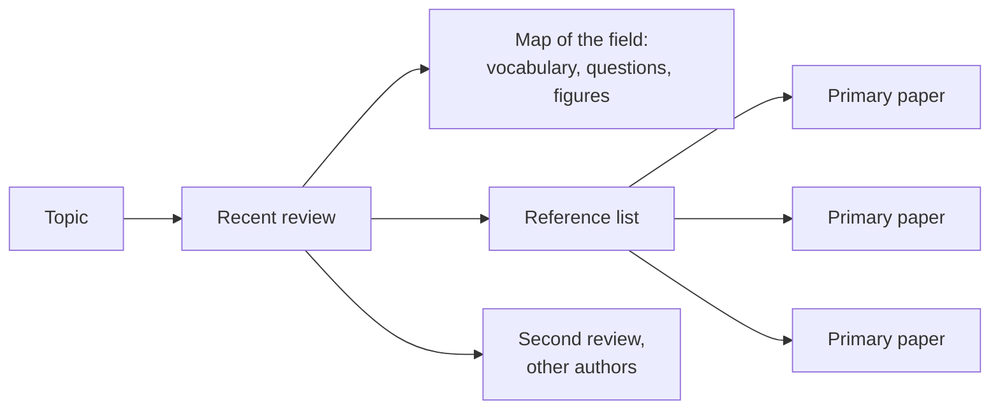

---
aliases:
  - Review
  - Literature Review
  - Narrative Review
  - Article de synthèse
  - Revue de littérature
tags:
  - type/concept
  - domain/scientific-practice
  - level/L1
  - level/L2
mastery: 0
prerequisites:
  - "[[Primary Literature]]"
  - "[[Scientific Paper]]"
related:
  - "[[Literature Search]]"
  - "[[Systematic Review]]"
  - "[[Meta-Analysis]]"
  - "[[Hierarchy of Evidence]]"
  - "[[Critical Appraisal]]"
  - "[[Confirmation Bias]]"
  - "[[Publication Bias]]"
projects: []
sources:
  - "[[Pautasso 2013 - Ten Simple Rules for Writing a Literature Review]]"
  - "[[Coursera Stanford - Writing in the Sciences]]"
  - "[[Gusenbauer 2020 - Which Academic Search Systems Are Suitable for Systematic Reviews or Meta-Analyses]]"
  - "[[Wang 2009 - RNA-Seq - A Revolutionary Tool for Transcriptomics]]"
  - "[[Shendure 2008 - Next-Generation DNA Sequencing]]"
  - "[[Barabási 2004 - Network Biology]]"
  - "[[Hasin 2017 - Multi-Omics Approaches to Disease]]"
---

# Review Article

> [!abstract]
> A review article is an expert's map of a field built from many primary papers: the fastest way in, provided you remember that the map shows the field as its authors see it.

## Definition

A **review article** summarizes, organizes and evaluates the [[Primary Literature|primary literature]] on a topic without reporting new data; writing one is a genre of its own.[^sciwrite] Reviews exist because the output of papers exceeds what any scientist can read.[^pautasso] In a **narrative review** the authors choose which studies to discuss and how to frame them, without reporting a search protocol. A **systematic review** fixes its question, search and inclusion criteria in advance and reports them, which requires search systems that run precise, complete and reproducible Boolean queries.[^gusenbauer]

## Why it matters

- **Entering a field.** A good review gives the vocabulary, the main questions and the key papers in one read: [[Wang 2009 - RNA-Seq - A Revolutionary Tool for Transcriptomics]] introduced RNA-Seq to a broad audience,[^wang] and [[Barabási 2004 - Network Biology]] introduced many biologists to graph theory.[^barabasi]
- **A curated reading list.** Its reference list is the starting point of backward citation chaining ([[Literature Search]]).
- **Choosing methods.** Reviews of platforms or tools, such as [[Shendure 2008 - Next-Generation DNA Sequencing]], compare options a bioinformatician must choose between,[^shendure] but each reflects its date and its authors.

## Core (L1)

**Using a narrative review to enter a field.**

1. **Pick** a recent review in a recognized journal (a search restricted to reviews, [[Literature Search]]).
2. **Skim** the abstract, the section headings and the figures: they give the map and the vocabulary.
3. **Harvest** the reference list: note the primary papers cited for the central claims, especially those cited several times.
4. **Date and authors**: what has happened since publication? Do the authors review their own work or tool?
5. **Cross-check** with a second review written by another group.

| Kind | How studies are selected | Output | Main risk |
|---|---|---|---|
| Narrative review | chosen by the authors, not reported | overview and interpretation | the authors' view and their own work dominate |
| Mini-review, perspective | a few recent studies | a focused argument | an explicit viewpoint |
| Systematic review | declared, reproducible search and criteria | a documented, complete set of studies | inherits the gaps of the published literature |
| Meta-analysis | systematic set, then statistics | a pooled effect size | heterogeneous studies pooled together |

Choosing the type of review is itself a decision: a meta-analysis can be difficult to carry out.[^pautasso] See [[Systematic Review]] and [[Meta-Analysis]] (Stage 3).

## Deeper (L2)

**Where the bias toward the authors' view comes from.**

- **Selection.** A narrative review does not report how studies were found or why some were left out. A reader cannot tell "no study shows X" from "the authors did not cite the studies that show X".
- **Own work.** Reviewers have often published on the topic; this is a conflict of interest, and authors may overstate the importance of their own findings.[^pautasso]
- **Framing.** The structure of the review is the authors' model of the field; competing views may get one sentence. A title like "a revolutionary tool" announces a position.
- **Time.** A review freezes the field at its writing date; later results are absent, and citation counts keep rising long after the content has aged ([[Bibliometrics]]).

**Countermeasures.** Read two reviews by independent groups; check that central claims cite primary papers, not other reviews; read the competing-interest statement; for questions of effect (does treatment T work?), prefer a systematic review or meta-analysis, which sit higher in the [[Hierarchy of Evidence]]. The same habit of looking for disconfirming sources counters your own [[Confirmation Bias]].

## Computational representation

Nothing specific to compute: a review becomes data only through its reference list, which [[Literature Search]] treats as the out-edges of a node in a citation graph.

## Worked example

> [!example] Entering RNA-Seq through a review
> 1. **Record:** Wang Z, Gerstein M, Snyder M. *Nature Reviews Genetics* 10(1):57-63 (2009), free at PMC2949280.[^wang]
> 2. **Framing:** the title calls RNA-Seq "a revolutionary tool", and the review argues that it measures transcripts and isoforms more precisely than earlier methods.[^wang] Expect advantages to be emphasized more than limits.
> 3. **Date:** 2009. Later developments, such as single-cell RNA-seq and its technical noise ([[Brennecke 2013 - Accounting for Technical Noise in Single-Cell RNA-Seq Experiments]]), cannot be in it.
> 4. **Harvest:** list the primary papers cited for each claim of the abstract and read the figure that supports one of them in the original paper.
> 5. **Cross-check:** read [[Hasin 2017 - Multi-Omics Approaches to Disease]], an open-access review by another group eight years later, which places transcriptomics among the other omics layers.[^hasin]

## Common misconceptions

> [!warning] "A review is neutral"
> A narrative review shows the selection and interpretation of its authors, who may be invested in the topic.[^pautasso] Neutrality is approached by method (systematic search and criteria), not by genre.

> [!warning] "Citing the review is enough"
> Cite a review for an overview statement. For a specific result, cite the primary paper that produced it ([[Primary Literature]]).

> [!warning] "A systematic review is a longer review"
> The difference is the method, a declared and reproducible search and selection, not the number of pages or references.[^gusenbauer]

## Exercises

> [!question] Exercise 1 (L1)
> For each review in this vault, say what field it lets you enter and one reason to check its date: Shendure 2008, Barabási 2004, Wang 2009, Hasin 2017.

> [!success]- Solution
> Shendure 2008: next-generation sequencing platforms;[^shendure] platforms change within a few years. Barabási 2004: network biology and graph concepts;[^barabasi] network data have grown since. Wang 2009: RNA-Seq;[^wang] single-cell and later protocols are absent. Hasin 2017: multi-omics approaches to disease;[^hasin] integration methods move quickly. In each case use the review as a map, then look for newer primary papers.

> [!question] Exercise 2 (L2)
> A narrative review of read aligners is written by the developers of aligner X. X gets three paragraphs and two figures; each competitor gets one sentence. Name the bias and two ways to correct for it.

> [!success]- Solution
> Own-work bias, a conflict of interest that Pautasso's rule 9 warns about.[^pautasso] Corrections: read an independent benchmark or a review by another group; check the primary papers of the competitors for the conditions under which they perform best.

> [!question] Exercise 3 (L2)
> Why can a narrative review not support the statement "no study has found an effect of E", while a systematic review can, at least for the databases it searched?

> [!success]- Solution
> The narrative review does not report its search, so absence in the review may be absence in the authors' selection. A systematic review states its databases, query, dates and criteria;[^gusenbauer] its "no study found" means "no study in this documented search", a claim others can check and update.

## Mastery checklist

- [ ] 1 Recognized: I can define a review article and tell narrative from systematic reviews.
- [ ] 2 Understood: I can explain the four sources of bias in a narrative review.
- [ ] 3 Practiced: I can use a review to build a list of key primary papers and cross-check it with a second review.
- [ ] 4 Applied: I entered a new topic for a Lab project through two independent reviews and cited primary papers for each result.
- [ ] 5 Explained: I can explain when a narrative review is enough and when a systematic review or meta-analysis is needed.

## References

[^sciwrite]: [[Coursera Stanford - Writing in the Sciences]], module "Other genres" (review papers).
[^pautasso]: [[Pautasso 2013 - Ten Simple Rules for Writing a Literature Review]], introduction, rules 4 and 9.
[^gusenbauer]: [[Gusenbauer 2020 - Which Academic Search Systems Are Suitable for Systematic Reviews or Meta-Analyses]], *Research Synthesis Methods*.
[^wang]: [[Wang 2009 - RNA-Seq - A Revolutionary Tool for Transcriptomics]], *Nature Reviews Genetics* 10(1):57-63.
[^barabasi]: [[Barabási 2004 - Network Biology]], *Nature Reviews Genetics* 5(2):101-113.
[^shendure]: [[Shendure 2008 - Next-Generation DNA Sequencing]], *Nature Biotechnology* 26(10):1135-1145.
[^hasin]: [[Hasin 2017 - Multi-Omics Approaches to Disease]], *Genome Biology* 18:83.
