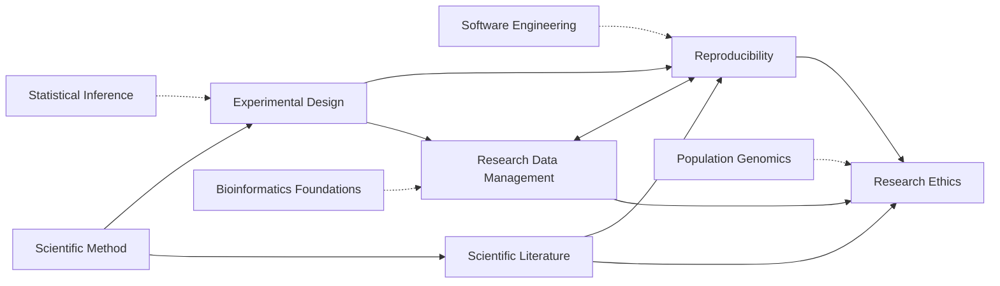

---
aliases:
  - Research Methods
  - Pratique scientifique
tags:
  - type/moc
  - domain/scientific-practice
  - domain/statistics
  - domain/bioinformatics
  - level/L1
  - level/L2
  - level/L3
  - level/M1
prerequisites: []
projects:
  - "[[Bioinformatics Lab]]"
  - "[[07-evolution-simulator]]"
  - "[[10-genomic-pipeline]]"
sources:
  - "[[Curriculum Benchmark]]"
  - "[[Carnegie Mellon University - BS Computational Biology]]"
  - "[[Stanford University - BS Biomedical Computation]]"
  - "[[MIT - Course 7 Biology]]"
  - "[[Modern Statistics for Modern Biology (Holmes)]]"
  - "[[Experimental Design for Laboratory Biologists (Lazic)]]"
  - "[[The Turing Way]]"
  - "[[ELIXIR RDMkit]]"
  - "[[On Being a Scientist (National Academies)]]"
  - "[[Coursera Stanford - Writing in the Sciences]]"
---

# Scientific Practice

> [!abstract]
> How science is done well: forming testable hypotheses, designing experiments that can answer them, making results reproducible, managing and sharing data, reading and writing the literature, and doing all of it ethically.

## Why it matters for bioinformatics

Bioinformatics produces claims from data that someone else generated, with pipelines of many steps and choices. Every classic failure of the field (batch effects mistaken for biology, irreproducible pipelines, unpublishable data without metadata, re-identifiable genomes) is a failure of practice, not of algorithms. This domain is the quality layer on top of [[Probability and Statistics]], [[Computer Science]] and [[Bioinformatics]].

## Target level and weight

- **Target**: L3, with a few M1 topics in [[Research Ethics]].
- **Weight**: light, integration track. [[Curriculum]] places one or two of its subdomains in each stage (Scientific Method in Stage 1, Experimental Design and Scientific Literature in Stage 2, Reproducibility and Research Data Management in Stage 3, Research Ethics in Stage 4), studied alongside the main tracks, not as a block.
- Real programs spread it the same way: research requirements, communication subjects and a short ethics course rather than a large module.[^cmu][^stanford][^mit7] Weights across domains come from [[Curriculum Benchmark]].[^bench]

## Subdomains

| Subdomain | Stage(s) | Target level | Scope |
|---|---|---|---|
| [[Scientific Method]] | 1 (revisited in 2 and 3) | L1 to L3 | Hypotheses, falsifiability, controls, causality, evidence, in silico experiments |
| [[Experimental Design]] | 2, 3 | L2, L3 | Replicates, controls, randomization, blocking, confounding, pilot studies, batch effects, sequencing designs, clinical trials |
| [[Reproducibility]] | 3 | L2, L3 | Reproducibility crisis, questionable practices, computational reproducibility, provenance, preregistration, research compendia |
| [[Research Data Management]] | 3 | L2, L3 | Data life cycle, metadata, FAIR, minimum information standards, repositories, licenses |
| [[Scientific Literature]] | 2 (from 1 for reading) | L1 to L3 | Finding, reading, appraising and writing papers; peer review, preprints, open access, systematic reviews |
| [[Research Ethics]] | 4 | L2 to M1 | Integrity, misconduct, consent, genomic privacy, re-identification, dual use, Nagoya Protocol |

## Dependencies

Dashed arrows are prerequisites from other domains.

## Cross-domain prerequisites

- [[Descriptive Statistics]] and [[Statistical Inference]] ([[Hypothesis Testing]], [[P-Value]], [[Statistical Power]]) before [[Experimental Design]] and [[Reproducibility]].
- [[Software Engineering]] ([[Version Control]], [[Unit Testing]], [[Continuous Integration]]) and [[Computer Systems]] ([[Container]]) before computational reproducibility.
- [[Bioinformatics Foundations]] ([[Biological Database]], [[Accession Number]], [[Biological Ontology]]) before [[Research Data Management]].
- [[Genetics]] and [[Population Genomics]] ([[Single Nucleotide Polymorphism]], [[Genome-Wide Association Study]]) before the genomic privacy part of [[Research Ethics]].

## Reference courses and books

| Source | Kind | Covers |
|---|---|---|
| [[Modern Statistics for Modern Biology (Holmes)]] | Book | Design of high-throughput experiments, reproducible analysis with code[^msmb] |
| [[Experimental Design for Laboratory Biologists (Lazic)]] | Book | Experimental units, pseudoreplication, randomization, blocking for lab biology[^lazic] |
| [[The Turing Way]] | Handbook | Reproducible, ethical and collaborative data science[^turing] |
| [[ELIXIR RDMkit]] | Website | Research data management for the life sciences, by data life cycle stage[^rdmkit] |
| [[On Being a Scientist (National Academies)]] | Book | Responsible conduct of research: integrity, data, authorship, misconduct[^obas] |
| [[Coursera Stanford - Writing in the Sciences]] | Course | Scientific writing, the manuscript, peer review, publication ethics, grants, science communication[^sciwrite] |

## Lab projects

- [[Bioinformatics Lab]]: tests from day one, CI and a standard repository layout with a LICENSE are the practical side of [[Reproducibility]] and [[Research Data Management]].
- [[07-evolution-simulator]]: reproducible random seeds and controlled parameter sweeps, an [[In Silico Experiment]].
- [[10-genomic-pipeline]]: provenance, metadata and reproducibility on real data.

## References

[^bench]: [[Curriculum Benchmark]].
[^cmu]: [[Carnegie Mellon University - BS Computational Biology]], computational biology core (02-135 Ethics in the Practice of Computational Biology, 02-402 seminar).
[^stanford]: [[Stanford University - BS Biomedical Computation]], directed research requirement.
[^mit7]: [[MIT - Course 7 Biology]], 7.19 Communication in Experimental Biology.
[^msmb]: [[Modern Statistics for Modern Biology (Holmes)]], chapter on the design of high-throughput experiments.
[^lazic]: [[Experimental Design for Laboratory Biologists (Lazic)]].
[^turing]: [[The Turing Way]].
[^rdmkit]: [[ELIXIR RDMkit]].
[^obas]: [[On Being a Scientist (National Academies)]].
[^sciwrite]: [[Coursera Stanford - Writing in the Sciences]].
