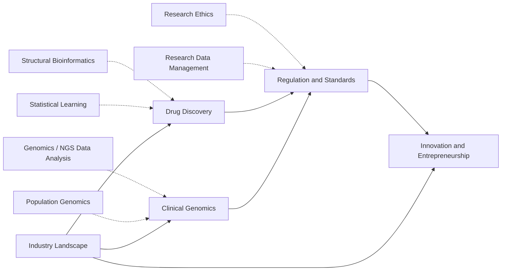

---
aliases:
  - Industry
  - Bioinformatics in Industry
  - Industrie et innovation
tags:
  - type/moc
  - domain/industry
  - domain/bioinformatics
  - domain/scientific-practice
  - level/L3
  - level/M1
prerequisites:
  - "[[Bioinformatics]]"
  - "[[Scientific Practice]]"
projects:
  - "[[Bioinformatics Lab]]"
  - "[[03-genome-diff]]"
  - "[[06-mutation-lab]]"
  - "[[10-genomic-pipeline]]"
  - "[[biolab-web]]"
sources:
  - "[[ISCB - Bioinformatics Core Competencies]]"
  - "[[ETH Zurich - BSc Biology]]"
  - "[[MIT 7.016 - Introductory Biology]]"
  - "[[Hughes 2011 - Principles of Early Drug Discovery]]"
  - "[[Richards 2015 - Standards and Guidelines for the Interpretation of Sequence Variants]]"
  - "[[MIT 15.136J - Principles and Practice of Drug Development]]"
  - "[[Basic Principles of Drug Discovery and Development (Blass)]]"
  - "[[NHGRI DNA Sequencing Costs]]"
---

# Industry and Innovation

> [!abstract]
> Where bioinformatics is used outside academic research and under which rules: the employers and their business models, the drug discovery and development pipeline, clinical genomics, the regulations and quality standards that govern diagnostics and health data, and how discoveries become products.

## Why it matters for bioinformatics

Outside universities, bioinformaticians work in pharma and biotech R&D, clinical and diagnostic laboratories, service providers and tool vendors. In those settings, the science is the same but the constraints change: a variant report or a pipeline is a regulated product, data are protected by law, and software is validated, licensed and sold. Knowing the pipeline, the standards and the vocabulary (ACMG classes, IVDR, GxP, SaMD) turns a good analyst into someone who can work there.[^iscb][^hughes][^acmg]

## Target level and weight

- **Target**: L3/M1, from [[Curriculum]] Stage 4 only.
- **Weight**: light; a professional orientation layer, not a core science. Degree programs expose students to it through applications in introductory courses and optional industrial internships, not through required courses.[^mit7016][^eth]

## Subdomains

| Subdomain | Stage(s) | Target level | Scope |
|---|---|---|---|
| [[Industry Landscape]] | 4 | L3 | Employers (pharma, biotech, CROs, clinical labs, diagnostics, tool vendors, agritech, public institutes) and bioinformatics roles |
| [[Drug Discovery]] | 4 | L3, M1 | Pipeline from target to approval, and where computation enters (targets, virtual screening, QSAR, AI) |
| [[Clinical Genomics]] | 4 | L3, M1 | Genetic testing, variant classification, pharmacogenomics, precision oncology, screening |
| [[Regulation and Standards]] | 4 | L3, M1 | FDA and EMA, IVDR and MDR, CLIA, ISO 15189, GxP, SaMD, GDPR and HIPAA, health data standards |
| [[Innovation and Entrepreneurship]] | 4 | L3, M1 | Technology transfer, patents on sequences and software, business models, market trends |

## Dependencies

Dashed arrows are prerequisites from other domains.

## Cross-domain prerequisites

- [[Genetics]], [[NGS Data Analysis]], [[Genomics]] ([[Variant Calling]], [[Variant Annotation]]) and [[Population Genomics]] before [[Clinical Genomics]].
- [[Biochemistry]], [[Organic Chemistry]], [[Structural Bioinformatics]] and [[Statistical Learning]] before [[Drug Discovery]].
- [[Research Ethics]] and [[Research Data Management]] before [[Regulation and Standards]].
- [[Experimental Design]] ([[Randomized Controlled Trial]]) before clinical trials.

## Reference courses and books

| Source | Kind | Covers |
|---|---|---|
| [[MIT 15.136J - Principles and Practice of Drug Development]] | Course | Discovery, preclinical and clinical development, manufacturing, regulation and economics of drugs[^mit15136] |
| [[Basic Principles of Drug Discovery and Development (Blass)]] | Book | Targets, screening, medicinal chemistry, ADMET, clinical trials, regulation[^blass] |
| [[Richards 2015 - Standards and Guidelines for the Interpretation of Sequence Variants]] | Paper | The ACMG/AMP variant classification standard used by clinical laboratories[^acmg] |
| [[ISCB - Bioinformatics Core Competencies]] | Framework | What employers and training programs expect a bioinformatician to be able to do[^iscb] |
| [[NHGRI DNA Sequencing Costs]] | Dataset | Cost per megabase and per genome since 2001, the reference for sequencing market trends[^nhgri] |

## Lab projects

- [[03-genome-diff]] and [[06-mutation-lab]]: variant consequences are the first step of clinical interpretation; 06 states that it is not a clinical prediction, the line between a research tool and a medical device.
- [[10-genomic-pipeline]]: the shape of a clinical bioinformatics pipeline, minus validation and accreditation.
- [[Bioinformatics Lab]] and [[biolab-web]]: a public portfolio and a product layer; licensing and open source choices.

## References

[^iscb]: [[ISCB - Bioinformatics Core Competencies]].
[^hughes]: [[Hughes 2011 - Principles of Early Drug Discovery]], *British Journal of Pharmacology*.
[^acmg]: [[Richards 2015 - Standards and Guidelines for the Interpretation of Sequence Variants]], *Genetics in Medicine*.
[^mit7016]: [[MIT 7.016 - Introductory Biology]], applications: therapeutics and research tools.
[^eth]: [[ETH Zurich - BSc Biology]], master target: optional industrial internship in the Master in Computational Biology and Bioinformatics.
[^mit15136]: [[MIT 15.136J - Principles and Practice of Drug Development]].
[^blass]: [[Basic Principles of Drug Discovery and Development (Blass)]].
[^nhgri]: [[NHGRI DNA Sequencing Costs]].
