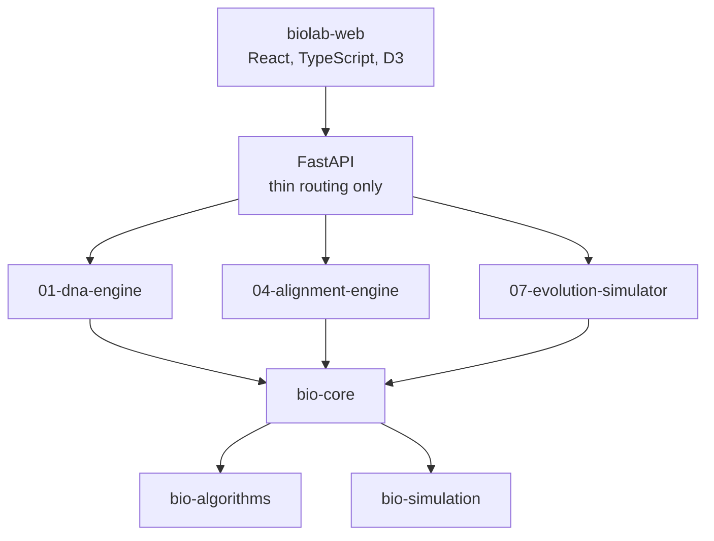

---
aliases:
  - BioLab
  - Lab
tags:
  - type/project
  - domain/bioinformatics
  - domain/computer-science
repository: https://github.com/Bioinformatics-PM
status: active
prerequisites: []
sources: []
---

# Bioinformatics Lab

> [!abstract]
> The implementation layer of this curriculum: an ecosystem of repositories where each project stands alone and plugs into a common platform.

## Three layers

| Layer | Where | Role |
|---|---|---|
| Knowledge | this vault | Concepts, sources, curriculum |
| Implementation | Lab repositories | Libraries and projects, tested and documented |
| Product | [[biolab-web]] | Interactive interfaces over the projects |

## Architecture



- **Libraries** (`bio-*`): [[bio-core]], [[bio-algorithms]], [[bio-simulation]], [[bio-visualization]]. No duplicated code across projects.
- **Projects** (numbered): each one is understandable, installable and testable on its own.
- **API layer** routes requests; the scientific logic lives in the libraries (API → domain → algorithm).

## Projects

| # | Project | Stage | Main concepts |
|---|---|---|---|
| 01 | [[01-dna-engine]] | 1 | [[DNA]], [[GC Content]], [[Reverse Complement]] |
| 02 | [[02-sequence-translation]] | 1 | [[Transcription]], [[Translation]], [[Open Reading Frame]] |
| 03 | [[03-genome-diff]] | 2 | [[Mutation]], [[Genetic Variant]], [[VCF Format]] |
| 04 | [[04-alignment-engine]] | 2 | [[Dynamic Programming]], [[Smith-Waterman Algorithm]] |
| 05 | [[05-sequence-search]] | 2 | [[K-mer]], [[Seed and Extend]], [[BLAST]] |
| 06 | [[06-mutation-lab]] | 2 | [[Missense Mutation]], [[Frameshift Mutation]] |
| 07 | [[07-evolution-simulator]] | 3 | [[Genetic Drift]], [[Wright-Fisher Model]] |
| 08 | [[08-phylogenetic-engine]] | 3 | [[Phylogenetic Tree]], [[Neighbor Joining]] |
| 09 | [[09-genome-browser]] | 3 | [[Gene Annotation]], [[Interval Tree]] |
| 10 | [[10-genomic-pipeline]] | 3 | [[Variant Calling]], [[Reproducibility]] |

## Official stack

| Area | Choice |
|---|---|
| Python | 3.13+, uv, Ruff, pytest, mypy; later NumPy, SciPy, pandas, NetworkX, Biopython |
| Frontend | React, TypeScript, Vite, Tailwind, shadcn/ui, TanStack Query, D3.js |
| Backend | FastAPI, no scientific logic in routes |
| Quality | Tests from day one (edge cases, then property-based testing with Hypothesis), GitHub Actions |

Libraries are allowed only after the concept has been implemented by hand once.

## Standard repository layout

```text
src/<package>/   tests/   examples/   docs/   benchmarks/
pyproject.toml   README.md   LICENSE   .github/workflows/
```

README sections: Objective · Biological concepts · Technical concepts · Architecture · Algorithms · Usage · Examples · Benchmarks · Tests · Limitations · What I learned · Next step.

## Rules

1. Each project answers four questions: biology (what is modeled), mathematics (which model), computer science (how, efficiently), product (how it becomes a usable tool).
2. Create a repository only when the previous project is done.
3. AI comes after the ten projects, as an interface over a deterministic scientific engine, never as the engine.
